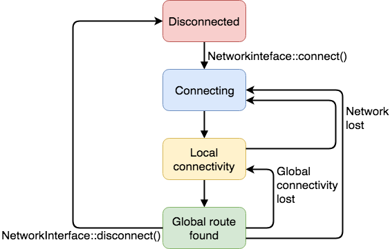

<h2 id="network-status">Network status</h2>

This interface informs you about connection state changes asynchronously. Providing a method to register a callback function to a socket accomplishes this. Each time the network interface's state changes, it triggers the callback.





#### Usage

The callback needs to handle these possible network states:

```
/** Enum of connection status types
 *
 *  Valid error codes have negative values.
 *
 *  @enum nsapi_connection_status
 */
 typedef enum nsapi_connection_status {
    NSAPI_STATUS_LOCAL_UP,            /*!< local IP address set */
    NSAPI_STATUS_GLOBAL_UP,           /*!< global IP address set */
    NSAPI_STATUS_DISCONNECTED,        /*!< no connection to network */
    NSAPI_STATUS_CONNECTING,          /*!< connecting to network */
    NSAPI_STATUS_ERROR_UNSUPPORTED  = NSAPI_ERROR_UNSUPPORTED
} nsapi_connection_status_t;
```

This API requires an interface to be monitored. For example, Ethernet:

```cpp TODO
EthernetInterface eth;
```

You need to provide the callback function, itself:

```cpp
void status_callback(nsapi_event_t status, intptr_t param)
{
    if (status == NSAPI_EVENT_CONNECTION_STATUS_CHANGE) {
        printf("Connection status changed!\r\n");
        switch(param) {
            case NSAPI_STATUS_LOCAL_UP:
                printf("Local IP address set!\r\n");
                break;
            case NSAPI_STATUS_GLOBAL_UP:
                printf("Global IP address set!\r\n");
                break;
            case NSAPI_STATUS_DISCONNECTED:
                printf("No connection to network!\r\n");
                break;
            case NSAPI_STATUS_CONNECTING:
                printf("Connecting to network!\r\n");
                break;
            default:
                printf("Not supported");
                break;
        }
    }
}
```

Now, the callback function is registered to the interface.

```cpp TODO
    eth.attach(&status_callback);
```

This allows the application to monitor if network interface gets disconnected.

Optionally, the application might want to set the `connect()` method to nonblocking mode and wait until connectivity is fully established.

```cpp TODO
    eth.set_blocking(false);
    eth.connect();              // Return immediately
```

By default, the `connect()` call blocks until `NSAPI_STATUS_GLOBAL_UP` state is reached. Some applications might require only link-local connectivity and therefore do not need to block that long. In those case monitoring the state changes is the preferred behavior.

### Example

Registering a status callback that connection state changes trigger depends on whether the network interface provides this functionality.

[](https://os.mbed.com/teams/mbed_example/code/TCPSocket_ConnStateCb_Example/file/8a8191e3d305/main.cpp)

### Related content

- [Network socket](network-socket.html) API reference overview.
