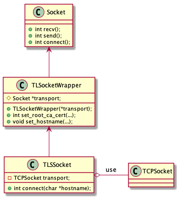

# Secure Socket

Mbed OS provides an interface for creating secure connections in the form of TLS stream. The `TLSSocketWrapper` class gives you the ability to secure any stream-based socket connection, for example TCP stream. This allows you to use existing protocol libraries through secure connections.

`TLSSocketWrapper` inherits the `Socket` class, which allows any application that uses `Socket` to use `TLSSocketWrapper` instead. Secure socket both uses the Socket interface as its transport layer and implements it. This makes it transport independent, and there is no direct dependency on the IP stack. For example, you can use the HTTP library and give `TLSSocketWrapper` to it to covert it to HTTPS.

The helper class called `TLSSocket` contains internal TCP socket for transport stream.

# Usage example

`TLSSocketWrapper` implements the Mbed OS Socket API and extends it with functions that allow configuring security certificates, so it is straightforward to use after setting up. Please note that for most of the use cases, you are using these methods through `TLSSocket` class:

```
TLSSocket *socket = new TLSSocket();
socket->open(network)
socket->set_root_ca_cert(certificate);

socket->connect(HOST_NAME, PORT)

socket->send(data, size);
```

<span class="notes">**Note:** Internal TLS structures require over 1 KB of RAM. Allocate each TLS Socket from the heap by using the `new` command, instead of using stack or statically allocating it.</span>

# Design

Internally `TLSSocket` consists of two classes, `TLSSocketWrapper` and `TLSSocket`, as shown in the following diagram:

<span class="images"><span>TLSSocket UML</span></span>

The `TLSSocketWrapper` can use any `Socket` as its transport. `TLSSocket` is a helper that uses directly `TCPSocket` for its transport, so you can adopt existing TCP based applications to TLS.

One use case of `TLSSocketWrapper` is that you can upgrade the existing TCP socket to TLS, by wrapping it like this:

```
TCPSocket connection;
connection.open(net);
connection.connect(SERVER, PORT);

// First talk with the server without encryption
connection.send("STARTTLS\r\n", 10);

// Wrap the TCP into TLS object
TLSSocketWrapper tls = new TLSSocketWrapper(connection, SERVER, TLSSocketWrapper::TRANSPORT_CLOSE);

// Initiate TLS handshake
tls.connect();

// Now the secure connection can be used like regular socket
tls.send("HELLO", 5);
```

## Configuring certificates

`TLSSocketWrapper` provides the following API to set server certificate. You can use either BASE64 formatted PEM certificate or binary DER certificates. The latter form of these functions assumes `root_ca_pem` or `client_cert_pem` to be standard C string, counts its length and passes to method, which takes only `void*` and `len`.

```
/** Sets the certification of Root CA.
 *
 * @param root_ca Root CA Certificate in any mbed-TLS supported format.
 * @param len     Length of certificate (including terminating 0 for PEM).
 */
nsapi_error_t TLSSocketWrapper::set_root_ca_cert(const void *root_ca, size_t len);

/** Sets the certification of Root CA.
 *
 * @param root_ca_pem Root CA Certificate in PEM format
 */
nsapi_error_t TLSSocketWrapper::set_root_ca_cert(const char *root_ca_pem);
```

If client authentication is required, the following API allows you to set the client certificate and private key:

```
/** Sets client certificate, and client private key.
 *
 * @param client_cert Client certification in any mbed-TLS supported format.
 * @param client_private_key Client private key in PEM format.
 */
nsapi_error_t TLSSocketWrapper::set_client_cert_key(const void *client_cert_pem, size_t client_cert_len,
                                                    const void *client_private_key_pem, size_t client_private_key_len);

/** Sets client certificate, and client private key.
 *
 * @param client_cert_pem Client certification in PEM format.
 * @param client_private_key Client private key in PEM format.
 */
nsapi_error_t TLSSocketWrapper::set_client_cert_key(const char *client_cert_pem, const char *client_private_key_pem);
```

## Socket API

`TLSSocketWrapper` implements the [Mbed OS Socket API](../apis/network-socket.html):

```
virtual nsapi_error_t close();
```

This destroys the memory the TLS library allocates. It also closes the transport socket, unless [transport mode](#transport-modes) is set to `TRANSPORT_KEEP` or `TRANSPORT_CONNECT`:

```
virtual nsapi_error_t connect(const SocketAddress &address);
```

The code above initiates the TCP connection and continues to the TLS handshake. If [transport mode](#transport-modes) is either `TRANSPORT_KEEP` or `TRANSPORT_CLOSE`, TCP is assumed to be open and state directly goes into TLS handshake. This is currently forced to blocking mode. After connecting, you can set it to nonblocking mode:

```
virtual nsapi_size_or_error_t send(const void *data, nsapi_size_t size);
virtual nsapi_size_or_error_t recv(void *data, nsapi_size_t size);
virtual nsapi_size_or_error_t sendto(const SocketAddress &address, const void *data, nsapi_size_t size);
virtual nsapi_size_or_error_t recvfrom(SocketAddress *address, void *data, nsapi_size_t size);
```

These work as expected, but `SocketAddress` parameters are ignored. The TLS connection cannot change the peer. Also, `recvfrom()` call does not set the peer address.

Mbed TLS error codes `MBEDTLS_ERR_SSL_WANT_READ` and `MBEDTLS_ERR_SSL_WANT_WRITE` are translated to `NSAPI_ERROR_WOULD_BLOCK` before passing to user.

`MBEDTLS_ERR_SSL_PEER_CLOSE_NOTIFY` is ignored, and zero is returned to you (connection closed). Other error codes are passed through:

```
virtual nsapi_error_t bind(const SocketAddress &address);
virtual void set_blocking(bool blocking);
virtual void set_timeout(int timeout);
virtual void sigio(mbed::Callback<void()> func);
virtual nsapi_error_t setsockopt(int level, int optname, const void *optval, unsigned optlen);
virtual nsapi_error_t getsockopt(int level, int optname, void *optval, unsigned *optlen);
```

These are passed through to transport socket.

```
virtual Socket *accept(nsapi_error_t *error = NULL);
virtual nsapi_error_t listen(int backlog = 1);
```

These are returning `NSAPI_ERROR_UNSUPPORTED` as you can't set TLS socket to listening mode.

## Transport modes

`TLSSocketWrapper` has four modes that are given in the constructor and affect how the transport Socket is used in connection and closing phases:

| Mode | Behavior on transport socket |
|------|------------------------------|
|TRANSPORT_KEEP | Keep the transport as it is. Does not call `connect()` or `close()` methods. |
|TRANSPORT_CONNECT_AND_CLOSE | Both `connect()` and `close()` are called. (default) |
|TRANSPORT_CONNECT | Call `connect()`, but do not close the connection when finished.  |
|TRANSPORT_CLOSE | Call `close()` when connection is finished. |

The default mode is `TRANSPORT_CONNECT_AND_CLOSE`.

## Advanced use: using internal Mbed TLS structures

You may choose to use internal Mbed TLS structures to configure the TLS instance. This is supported by exposing some Mbed TLS structures like this:

```
mbedtls_x509_crt *get_own_cert();
int set_own_cert(mbedtls_x509_crt *);
mbedtls_x509_crt *get_ca_chain();
void set_ca_chain(mbedtls_x509_crt *);
mbedtls_ssl_config *get_ssl_config();
void set_ssl_config(mbedtls_ssl_config *);
```

For guidance of how to use these, please refer to the [Mbed TLS documentation](../apis/tls.html).

# Related content

- [Security overview](../apis/security.html).
- [TLSSocket](../apis/tlssocket.html) API reference.
- [DTLSSocket](../apis/dtlssocket.html) API reference.
