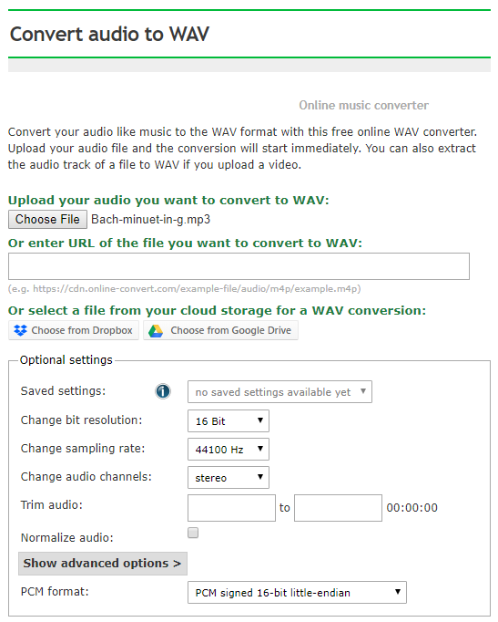
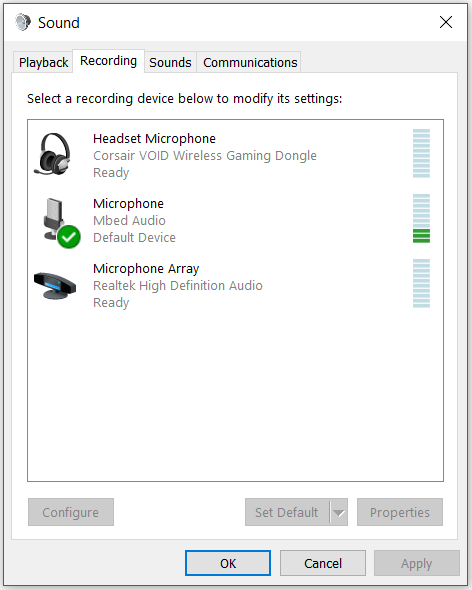

# USB WAV audio player

This tutorial explains how to put together a USB WAV audio player with Mbed OS. You will load a WAV file onto an SD card connected to an Mbed board. You can then play the WAV file from the board on a host computer over USB. The Mbed board acts as the computer's USB microphone. The sound that the microphone is "recording" is the data on the SD card that it sends to the host computer. This allows the sound to be played on speakers or headphones or recorded with a program, such as Audacity.

The example code below uses the following libraries in addition to `mbed.h`:

- `USBAudio.h` for accessing functions associated with USB audio.
- `SDBlockDevice.h` to make use of the SD card.
- `FATFileSystem.h` to set up a FAT file system on the SD card.
- `AudioPlayer.h` to access functions associated with reading and writing audio data.
- `WaveAudioStream.h` to access functions associated with WAV files.

This tutorial begins with the creation of a SPI connection to the SD card (SD object) and the creation of a FAT filesystem on the SD card (fs object).

After that, it guides you to:

1. Set the SPI frequency to 25,000,000 Hz.
1. Open the song (WAV) file that you have previously stored onto the SD card with the `file.open()` function. The string input parameter to this function must match the name of the file as it is on the SD card ("songs/Bach-minuet-in-g.wav").
1. Check the file is a valid WAV file by making it into a WaveAudioStream object and checking with the `song.get_valid()` function.
1. Check that the WAV file is 16-bit by making sure the `song.get_bytes_per_sample()` returns 2 (2 bytes).
1. Create the USBAudio object that allows you to write the data from the WAV file to the computer.
1. Initialize this object by giving it the parameters `true` to connect on initialization, a receive frequency of 8000 Hz, the number of channels used by the WAV file, a transmit frequency that matches the sample rate of the WAV file and the number of channels the WAV file uses.
1. Write all of the data from the WAV file to the computer over USB. This is done by reading data from the WAV file into a 1500-byte buffer and then writing the contents of that buffer to the computer through the `audio.write()` function until you reach the end of the data in the WAV file.
1. Close the WAV file object, and the program exits.

The steps below describe this in more detail.

## Libraries

This tutorial uses several Mbed libraries:

- [USB](../apis/usb.html) (part of Mbed OS).
- [sd-driver](https://github.com/ARMmbed/sd-driver) (external library).
- [AudioPlayer](https://github.com/c1728p9/AudioPlayer) (external library).

This tutorial uses the USBAudio class of the USB library to send audio data from the Mbed board to the host PC. It uses the SDBlockDevice and FATFileSystem classes of the `sd-driver` library, so you can store the WAV files on an SD card and the Mbed board can access them. Lastly, it uses the AudioPlayer and WaveAudioStream classes of the AudioPlayer library to access the audio data from the WAV file on the SD card.

## Requirements

- Mbed Enabled board.
- SD card.
- SD card shield (if the board does not already have an SD card port).
- USB cable.

[Please install Mbed CLI to complete the tutorial](../tools/installation-and-setup.html).

## Setup

The following steps demonstrate the setup and use of the Mbed WAV audio player:

1. Create a new Mbed project:

   `mbed new <project name>`

1. Add the [sd-driver](https://github.com/ARMmbed/sd-driver) and [AudioPlayer](https://github.com/c1728p9/AudioPlayer) libraries to the new Mbed project directory:

   `mbed add https://github.com/ARMmbed/sd-driver`    
   `mbed add https://github.com/c1728p9/AudioPlayer`

1. Copy and paste the [example code](../tutorials/usb-wav-audio-player.html#example-wav-file) into `main.cpp`.
1. Make sure the SPI pins for the SDBlockDevice object are updated and correct for your board. For example, in the example below, line 10 sets up SPI for the SDBlockDevice for the NXP K64F Mbed board.
1. Load WAV file(s) onto SD card. The example below uses a public domain WAV file called "Bach-minuet-in-g.wav" (attached below for download) that is inside a "songs" directory on the SD card. It is important that the WAV file be PCM signed 16-bit little endian, or else it will not play becaues USBAudio does not support any other WAV formats. The WAV file can have any sampling rate and can have any number of channels. You can use [Online-convert](https://audio.online-convert.com/convert-to-wav) to achieve WAV files with different formats from any source audio file. The file "Bach-minuet-in-g.wav" is already in the correct format.

   

1. Compile the program and flash the binary.
1. Make sure that the board is connected to the host PC over USB.
1. Select `Mbed Audio` as the host PC's default audio input device.

    On Windows, in Control Panel, set **View by** to **Category** in the top right corner. Then, navigate to **Hardware** and **Sound** > **Sound**, and in the recording tab, right click on **Microphone Mbed Audio** > **Properties** > **Listen**. Check the **Listen to this Device** box, and click **Apply**. The audio from the WAV file is now audible through whichever output device is selected for the host PC's audio output. If **View by** is not set to **Category**, audio will be under Sound in Control Panel:

   

   

## Troubleshooting   

If USB properties of the Mbed USB WAV Audio Player are altered, such as the sample rate or number of channels, the Mbed board will need to be deleted and re-installed in the host PC's installed device list. In Device Manager, click **View > Devices by Connection**. Find "Mbed Audio" and uninstall the device. Reset the board and repeat Setup step 6. If problems still persist, be sure to format the WAV file correctly, as is denoted in Setup step 4.   

## main.cpp

## Example WAV file  

[Bach-minuet-in-g.wav](https://github.com/ARMmbed/mbed-os-examples-docs_only/blob/master/APIs_USB/USBAudio_wav_audio_player/Bach-minuet-in-g.wav)

## Troubleshooting   

If USB properties of the Mbed USB WAV Audio Player are altered, such as the sample rate or number of channels, the Mbed board will need to be deleted and re-installed in the host PC's installed device list. In Device Manager, click View > Devices by Connection. Find "Mbed Audio" and uninstall the device. Reset the board and repeat Setup step 6. If problems still persist, be sure to format the WAV file correctly, as is denoted in Setup step 4.   

