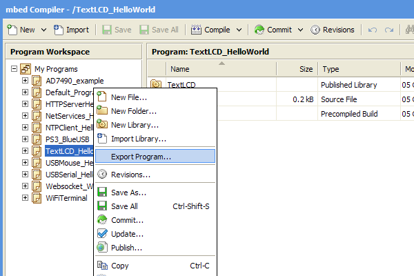
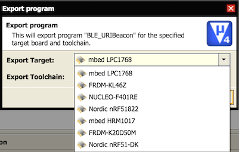

# Exporting to Offline Toolchains

If you'd like to develop on mbed OS with an offline tool, or migrate to one as your project develops past prototype, you can choose to export an mbed project to the toolchain of your choice:

* [Exporting to uVision](#uVision).

* [Exporting to Eclipse IDEs](#Eclipse) (LPCXpresso, Kinetis Design Studio, etc).

* [Exporting to Make](#Make) (GCC ARM Embedded, Code Sourcery).

* [Exporting to IAR Embedded Workbench](#IAR).

* [Keil uVision](#keil-uvision).

* [GCC](#gcc).

* [Kinetis Design Studio](#kinetis-design-studio).

* [GCC ARM Embedded](#gcc-arm-embedded).

Please note, changing the compiler toolchain introduces many degrees of freedom in the system; these differences include the translation of C/C++ code to assembly code, the link time optimizations, differences because of the implementations of the C standard libraries, and differences based on compile and link options. It also makes it a lot harder to share code and questions with other developers, as the context needs to be shared too!

While we support exporting your project and the libraries to an alternate toolchain, we cannot guarantee the same consistency as using the mbed Online Compiler. We will do our best to maintain the exported libraries, project file and makefiles, but please understand we can not cover all cases and combinations, or provide support for use of these alternate tools themselves.

## The mbed Online Compiler export mechanism

The mbed Online Compiler has a built-in export mechanism that supports multiple toolchains:

1. Right-click on a project you want to export.

1. Click **Export Program.** The **Export Program** window opens.

<span class="images"></span>

1. From the **Export Target** drop down list, select your board.

<span class="images"></span>

1. From the **Export Toolchain** drop down list, select your toolchain.

<span class="images"></span>


## uVision


[uVision](http://www.keil.com/uvision|) is one of the external offline toolchains supported by the mbed platform.

To export your mbed program for use in uVision, right-click the program in your program workspace. From the dialog, you can select the "Export To" as "Keil uVision4", and the target microcontroller you wish to export for. 

When you choose export, a zip file containing all the files you need for uVision will be generated. Unzip it and open the uVision project file ("project.uvproj"):

After building the project, the binary file (".bin"), ready to be flashed on the mbed, will be generated in the "build" directory.

<span style="text-align:center; display:block;">

</span>
<span style="text-align:center; display:block; padding:20px;">

</span>

________

<a name="Eclipse">
##Eclipse IDE
</a>

[Eclipse](https://eclipse.org/) is a widely-used, open source IDE that supports multiple languages. It is used by many offline toolchains, including [LPCXpresso](http://www.lpcware.com/lpcxpresso) and [Kinetis Design Studio](http://www.freescale.com/webapp/sps/site/prod_summary.jsp?code=KDS_IDE). The setup process for each IDE will vary depending on the distribution; however, the user interface between these distributions will not change much, so these instructions should be easy to apply to all Eclipse-based IDEs.

<span style="text-align:center; display:block;">

</span>

To export your mbed program for use in an Eclipse-based IDE, right-click the program in your program workspace. From the dialog, you can select your desired toolchain for the "Export Toolchain" field. Also, be sure to select the correct target platform under the "Export Target" field.

When you choose export, a zip file containing all the files you need will be generated. Unzip it anywhere and open your Eclipse-based IDE.

<span style="background-color:lightgray; color:purple; display:block; height:100%; padding:10px">
**NOTE:** All of the following screenshots will be using a plain Eclipse IDE installation with no embedded development plugins installed. This was done to keep these instructions as general as possible. Your IDE's user interface will most likely not match the 
following screenshots exactly, but it should be very similar.
</span>

<span style="text-align:center; display:block;">

</span>

Click File > Import…

<span style="text-align:center; display:block;">

</span>

In the dialog that pops up, under “General”, select “Existing Projects into Workspace” and click Next.

<span style="text-align:center; display:block;">

</span>

Next to the “Select root directory” field, click Browse. In the dialog that pops  up,  navigate to where you unzipped the downloaded program and select the folder. Hit “OK”.

<span style="text-align:center; display:block;">

</span>

In the “Projects” area, you should see the project name listed. Ensure the checkbox next to it is checked. Hit “Finish”.

Now your project should appear in the "Project Explorer" on the left side of the IDE.

After the build, your binary will be generated in the "Release", or "Debug" directory, depending on the selected configuration.

______

<a name="Make">
##Make
</a>


> "[GNU Make](http://www.gnu.org/software/make/) is a tool which controls the generation of executables and other non-source files of a program from the program's source files."
> 
>(Taken verbatim from the GNU Make website).

Make itself does not compile source code. It relies on a compiler like [GCC ARM Embedded](https://launchpad.net/gcc-arm-embedded) or [Code Sourcery (Sourcery CodeBench)](http://www.mentor.com/embedded-software/sourcery-tools/sourcery-codebench/overview/). Sourcery CodeBench is a paid tool and can be purchased on the [Mentor](http://www.mentor.com/) website. GCC ARM Embedded can be installed for free using instructions found [here](http://gnuarmeclipse.livius.net/blog/toolchain-install/).


<span style="background-color:lightyellow; color:black; display:block; height:100%; padding:10px">
**Warning:** The current Makefile requires that your compiler is added to your PATH variable. This contradicts the instruction given on the installation website because those instructions are intended for Eclipse, not Make.
</span>

<span style="text-align:center; display:block;">

</span>

To export your mbed program for use in Make, right-click the program in your program workspace. From the dialog, you can select your desired compiler under the "Export Toolchain" field. Also, be sure to select the correct target platform under the "Export Target" field.

When you choose export, a zip file containing all the files you need for Make will be generated. Unzip it and you are ready to launch make:

```c

	$ cd /my/program/directory/
	$ ls
	main.cpp  Makefile  mbed  mbed.lib

	$ make
	arm-none-eabi-g++ -c -Os -fno-common -fmessage-length=0 -Wall -fno-exceptions -mcpu=cortex-m3 -mthumb -ffunction-sections -fdata-sections  -DTARGET_LPC1768 -	DTOOLCHAIN_GCC_CS -DNDEBUG -std=gnu++98 -I./mbed -I./mbed/LPC1768 -I./mbed/LPC1768/GCC_CS  -o main.o main.cpp
	arm-none-eabi-gcc -mcpu=cortex-m3 -mthumb -Wl,--gc-sections -Tmbed/LPC1768/GCC_CS/LPC1768.ld -L./mbed -L./mbed/LPC1768 -L./mbed/LPC1768/GCC_CS  -o 	my_program.elf main.o mbed/LPC1768/GCC_CS/startup_LPC17xx.o mbed/LPC1768/GCC_CS/sys.o mbed/LPC1768/GCC_CS/cmsis_nvic.o mbed/LPC1768/GCC_CS/c	ore_cm3.o mbed/LPC1768/GCC_CS/system_LPC17xx.o -lmbed -lcapi -lstdc++ -lsupc++ -lm -lc -lgcc -lmbed -lcapi -lstdc++ -lsupc++ -lm -lc -lgcc
	arm-none-eabi-objcopy -O binary my_program.elf my_program.bin

	$ ls
	main.cpp  main.o  Makefile  mbed  mbed.lib  my_program.bin  my_program.elf
```

The binary file ``.bin`` is ready to be flashed on the mbed.

_______

<a name="IAR">
##IAR
</a>


The [IAR Embedded Workbench](http://www.iar.com/en/Products/IAR-Embedded-Workbench/) is one of the external offline toolchains supported by the mbed platform.

<span style="background-color:lightyellow; color:black; display:block; height:100%; padding:10px">
**Warning:** The support for the IAR toolchain has been added very recently (Jan 2013), if you are trying to export an old project make sure to update the mbed library to the latest build first.
</span>

To export your mbed program for use in the IAR Embedded Workbench, right-click the program in your program workspace. From the dialog, you can select the "Export To" as "IAR Systems", and the target microcontroller you wish to export for (currently, only the LPC1768 is supported):

<span style="text-align:center; display:block;">

</span>

When you choose export, a zip file containing all the files you need for the IAR Embedded Workbench will be generated. Unzip it and open the IAR Embedded Workbench workspace file ``.eww``.

After building the project, the binary file ``.bin``, ready to be flashed on the mbed, will be generated in the "Debug\Exe" directory:

<span style="text-align:center; display:block;">

</span>

# From the second page - must edit

Congratulations! You are one of the elite few who have chosen the path of ultimate power! You have chosen to take your code to an offline toolchain. This means you will acquire the power of traditional debug including, single step, break points, and oh so much more. But be careful, with great power comes greater responsibility.

You are leaving the online tools and their enhanced ease of use. With this step into the void you are now taking your destiny into your own hands. We have done our best to make the offline tools experience seamless and easy, unfortunately this is not always the case. Some toolchains and some boards will have issues. This page is our attempt at documenting those extra configuration options and providing the necessary details.

Now, go forth, be productive, and use the force, we believe in you!

-The mbed team.

## Keil uVision
The exporters are currently configured to use Keil MDK v4. MCUs released after Dec 2014 may not have device svd and flash programing algorithms provided with the installation. You will need to obtain these and install in the proper directory and then select in the project file.

* Nordic Platforms using SoftDevices
	* Download [[ http://developer.nordicsemi.com/nRF51_SDK/nRF51_SDK_v6.x.x/nrf51_sdk_v6_1_0_b2ec2e6.msi | nordic nrf51_SDK.]]
	* Install the nrf51_sdk and integrate with uVision when prompted
	* Right click on the project -> Options for Target... -> Utilities tab -> Configure Flash Menu Command Settings button -> Add button -> select nrf51xxx -> click Add -> Click OK -> click OK. Now you should be able to flash to the nrf51822 target.
* Maxim Platforms
	* Download the [[ /media/uploads/sam_grove/max32600.flm |MAX32600 Flash Algorithm.]]
	* Copy the file to directory: C:\Keil\ARM\Flash assuming the default install path was chosen.
* LPCXpresso824-MAX and Switch Science mbed LPC824 Platforms
	* Download the [[/media/uploads/MACRUM/lpc8xx_32.flm|LPC8xx_32k Flash Algorithm.]]
	* Copy the file to directory: C:\Keil\ARM\Flash assuming the default install path was chosen.

## GCC

Makefiles are created and to build you will need make installed and part of your path. Also you will need an arm-gcc compiler and linker.

* Nordic Platforms using SoftDevices
	* Windows
		*GCC exports targeting the NRF51822 also require some programs from the [[http://developer.nordicsemi.com/nRF51_SDK/nRF51_SDK_v6.x.x/nrf51_sdk_v6_1_0_b2ec2e6.msi | Nordic nrf51_SDK.]] Please download and install it from the nordic website to enable offline compiles with make on windows.
	*Linux
		* Need to install xxxx

## Kinetis Design Studio

Freescale KDS now ships with the GCC ARM Embedded toolchain. You may need to update a linker flag depending on the version of tools installed. Make the change in : [[/media/uploads/sam_grove/kds3_linkerflags.png | ##C++ Build -> Settings -> Tool Settings##]]


Open this dialog using ``[Alt] + Enter or [Option] + Enter``

Any file extension that is ``.s`` needs to be changed to ``.S`` (lowercase to uppercase)

KDS >= 3.0
``-specs=nosys.specs``

KDS < 3.0
``-nanolibc``

## atmelstudio

The mbed libraries contain CMSIS startup files. When importing the generated project file **it is required to un-check 'migrate to current infrastructure' box.**

## GCC ARM Embedded


[[https://launchpad.net/gcc-arm-embedded/|GNU Tools for ARM Embedded Processors]]  is one of the external offline toolchains supported by the mbed platform.

For a complete overview of the "export" feature, please refer to our general: [[Exporting to offline toolchains]].

To export your mbed program for use with the GNU Tools for ARM Embedded Processors, right-click the program in your program workspace. From the dialog, you can select the "Export To" as "GCC (ARM Embedded)", and the target microcontroller you wish to export for. 

{{/media/uploads/emilmont/gcc_arm.png}} 

When you choose export, a zip file containing all the files you need for the GNU Tools for ARM Embedded Processors will be generated. Unzip it and you are ready to launch make:
```
my_program$ ls
main.cpp  Makefile  mbed  mbed.lib

my_program$ make
arm-none-eabi-g++ -c -Os -fno-common -fmessage-length=0 -Wall -fno-exceptions -mcpu=cortex-m3 -mthumb -ffunction-sections -fdata-sections  -DTARGET_LPC1768 -DTOOLCHAIN_GCC_ARM -DNDEBUG -std=gnu++98 -I./mbed -I./mbed/LPC1768 -I./mbed/LPC1768/GCC_ARM  -o main.o main.cpp
arm-none-eabi-gcc -mcpu=cortex-m3 -mthumb -Wl,--gc-sections -Tmbed/LPC1768/GCC_ARM/LPC1768.ld -L./mbed -L./mbed/LPC1768 -L./mbed/LPC1768/GCC_ARM  -o my_program.elf main.o mbed/LPC1768/GCC_ARM/startup_LPC17xx.o mbed/LPC1768/GCC_ARM/core_cm3.o mbed/LPC1768/GCC_ARM/system_LPC17xx.o mbed/LPC1768/GCC_ARM/cmsis_nvic.o -lmbed -lcapi -lstdc++ -lsupc++ -lm -lc -lgcc
arm-none-eabi-objcopy -O binary my_program.elf my_program.bin

my_program$ ls
main.cpp  main.o  Makefile  mbed  mbed.lib  my_program.bin  my_program.elf
```
The binary file (".bin") is ready to be flashed on the mbed.
