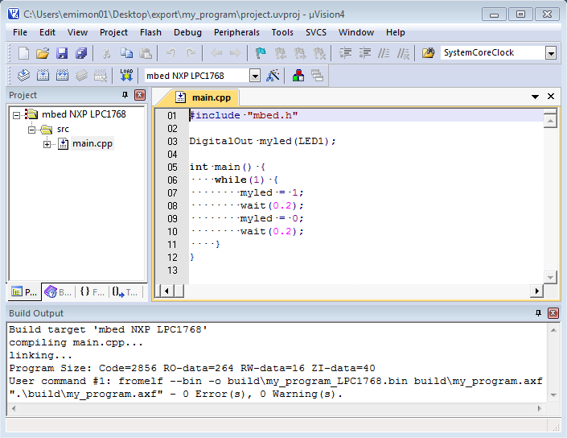

# Exporting to Offline Toolchains

If you'd like to develop on mbed OS with an offline tool, or migrate to one as your project develops past prototype, you can choose to export an mbed project to the following toolchains:

* Keil uVision4
* DS-5
* LPCXpresso
* GCC (Sourcery CodeBench)
* GCC (ARM Embedded)
* IAR Systems
* CooCox CoIDE
* Kinetis Design Studio
* Simplicity Studio
* Atmel Studio
* SW4STM32 System Workbench for STM32
* e2studio
* Uvision4 and Uvision5
* Emblocks
* ZIP Archive (with repositories)

This page reviews the mbed Online Compiler export process, and then offers solutions to common issues with some of the tools. It does not provide details instructions for working with any of the tools.

## The mbed Online Compiler export mechanism

The mbed Online Compiler has a built-in export mechanism that supports multiple toolchains:

1. Right-click on a project you want to export.

1. Click **Export Program.** The **Export Program** window opens.

	

1. From the **Export Target** drop down list, select your board.

	

1. From the **Export Toolchain** drop down list, select your toolchain.

	

1. The export process generates a ZIP file with a project file matching your selected toolchain. Follow your toolchain's import or project creation process to begin working there.

## Make (GCC ARM Embedded or Sourcery CodeBench)

> "[GNU Make](http://www.gnu.org/software/make/) is a tool which controls the generation of executables and other non-source files of a program from the program's source files."
> 
>(Taken verbatim from the GNU Make website).

Make itself does not compile source code. It relies on a compiler like:

* [GCC ARM Embedded](https://launchpad.net/gcc-arm-embedded), which can be installed for free using the instructions found [here](http://gnuarmeclipse.livius.net/blog/toolchain-install/). Please note that the current Makefile requires that your compiler is added to your PATH variable. This contradicts the instruction given on the installation website because those instructions are intended for Eclipse, not Make.
* [Sourcery CodeBench](http://www.mentor.com/embedded-software/sourcery-tools/sourcery-codebench/overview/) - a paid tool and can be purchased on the [Mentor](http://www.mentor.com/) website.

### GCC and Make on Windows: Nordic Platforms using SoftDevices
	
GCC exports targeting the NRF51822 require the [Nordic nrf51_SDK](http://developer.nordicsemi.com/nRF51_SDK/nRF51_SDK_v6.x.x/nrf51_sdk_v6_1_0_b2ec2e6.msi). Please download and install it.

## Kinetis Design Studio (Freescale KDS) with GCC ARM Embedded

Freescale KDS now ships with the GCC ARM Embedded toolchain. You may need to update a linker flag depending on the version of tools installed. 

1. Press **Alt + Enter** or **Option** + **Enter**. The **C++ Build** dialog opens.
1. In **Settings**, select **Tool Settings**.
1. Any file extension that is ``.s`` needs to be changed to ``.S`` (lowercase to uppercase):
	
	__KDS >= 3.0__

	``-specs=nosys.specs``

	__KDS < 3.0__

	``-nanolibc``

## Atmel Studio

The mbed libraries contain CMSIS startup files. When importing an mbed Online Compiler file to [Atmel Studio](http://www.atmel.com/Microsite/atmel-studio/), you must un-check the 'migrate to current infrastructure' box.

## Keil uVision4

[uVision](http://www.keil.com/uvision|) is one of the external offline toolchains supported by the mbed platform. Exporting to it creates a ZIP file with a uVision project file ``project.uvproj``.

### Installing missing algorithms

The exporters are currently configured to use Keil MDK v4. MCUs released after December 2014 may not have device svd and flash programing algorithms provided with the installation. You will need to obtain these and install in the proper directory, then select that directory in the project file.

__Nordic Platforms using SoftDevices:__

1. Download [http://developer.nordicsemi.com/nRF51_SDK/nRF51_SDK_v6.x.x/nrf51_sdk_v6_1_0_b2ec2e6.msi | nordic nrf51_SDK](http://developer.nordicsemi.com/nRF51_SDK/nRF51_SDK_v6.x.x/nrf51_sdk_v6_1_0_b2ec2e6.msi | nordic nrf51_SDK).
1. Install the nrf51_sdk and integrate with uVision when prompted.

To add the algorithm to your project file:
	
1. Right click on the project > **Options for Target...**
1. In the **Utilities** tab, click the **Configure Flash Menu Command Settings** button.
1. Click the **Add** button.
1. Select ``nrf51xxx``.
1. Click **Add** > Click **OK** > click **OK**. 

Now you should be able to flash to the nrf51822 target.

__Maxim Platforms__

1. Download [/media/uploads/sam_grove/max32600.flm |MAX32600 Flash Algorithm](/media/uploads/sam_grove/max32600.flm |MAX32600 Flash Algorithm).
1. Copy the file to directory ``C:\Keil\ARM\Flash`` (assuming the default install path was chosen).

__LPCXpresso824-MAX and Switch Science mbed LPC824 Platforms__

1. Download the [/media/uploads/MACRUM/lpc8xx_32.flm|LPC8xx_32k Flash Algorithm](/media/uploads/MACRUM/lpc8xx_32.flm|LPC8xx_32k Flash Algorithm).
1. Copy the file to the directory ``C:\Keil\ARM\Flash`` (assuming the default install path was chosen).

## Before you export

Changing the compiler toolchain introduces many degrees of freedom in the system; these differences include the translation of C/C++ code to assembly code, the link time optimizations, differences because of the implementations of the C standard libraries, and differences based on compile and link options.

While we support exporting your project and the libraries to an alternate toolchain, we cannot guarantee the same consistency as using the mbed Online Compiler. We will do our best to maintain the exported libraries, project file and makefiles, but please understand we can not cover all cases and combinations, or provide support for use of these alternate tools themselves.
