# Pull requests

A pull request lets you tell others about changes you've added to a fork of their (or ancestor) repository, effectively granting them permission to include and use your code in their codebase. Once the pull request is created, the other party can review, accept or reject the set of changes, discuss further modifications and even add follow-up changes or merges.

Think of pull requests as a simplified [fork and update](collab_intro.md) workflow, where the repository author(s) moderate the changes nonrepository developers contribute.

## Day to day usage

An important thing to know about pull requests is that they can only exist between related repositories. The term "related repositories" means that either repository is ancestor or sibling to the other through direct or indirect relationship (like a fork of the fork of the fork). Pull requests usually originate from a forked repository to ancestor repository, though the functionality is flexible and allows pull requests from ancestor repository to a forked repository (for cases where the original author wants to contribute later added code to a fork).

## Creating a pull request

All pull requests are created and recorded against the remote repository, the one receiving the modifications if the pull request is accepted.

### Creating a new request

To create a pull request:

1. When you publish a fork of another repository, the mbed developer site displays the ancestor repository under **Repository details**. If you are the repository owner, an additional **Create Pull Request** button will be displayed on top.

	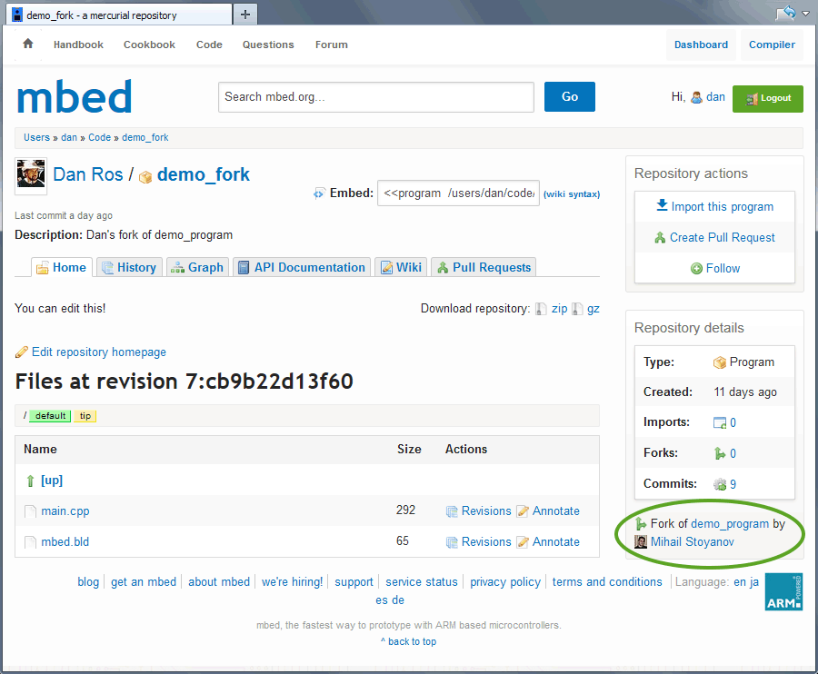

1. Click the **Create Pull Request** button. The **Create Pull Request** page opens, showing the URLs of the forked and the ancestor repositories:

	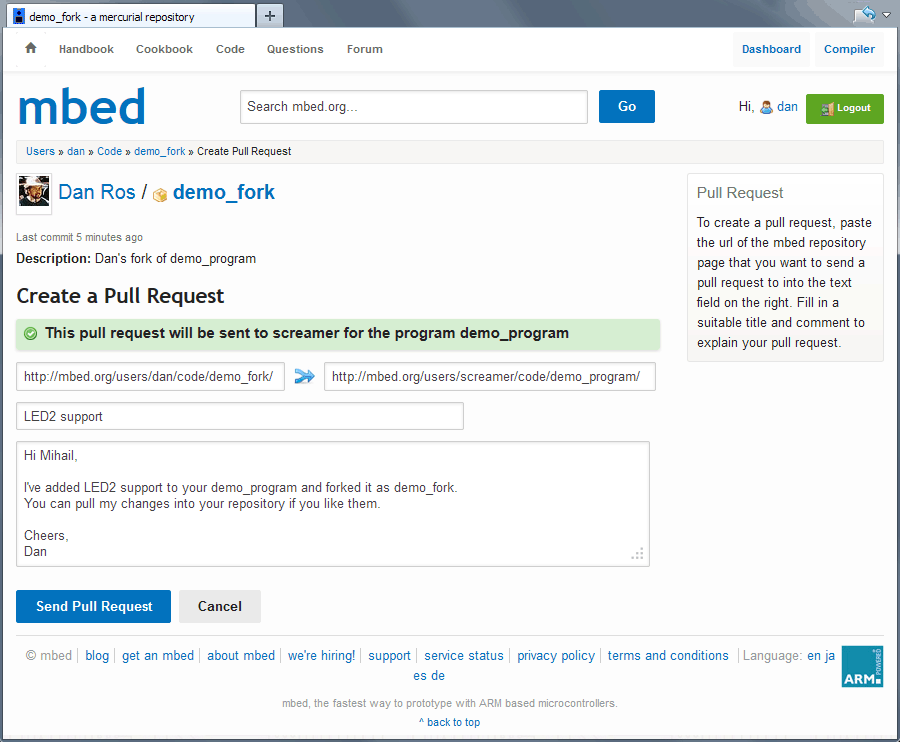

1. You can change the remote repository URL if you want to send a pull request to another related repository. The form will validate the repository URL addresses as you type or paste, and will warn if either of them is wrong, missing or unrelated. It will also check whether the forked repository (on the left) has changes that aren't present in the remote repository (on the right).

1. Add a suitable title and description that summarize the set of changes in the pull request, and specify any additional information the repository owners might find useful. It is also a good place to describe any licensing matters. As always, being polite goes a long way, and they might even add you as author to their repository!

1. Click the **Send Pull Request** button.

The pull request is added to the **Pull Requests** page of the repository, and an email is sent to the repository owners with the title and description you specified.

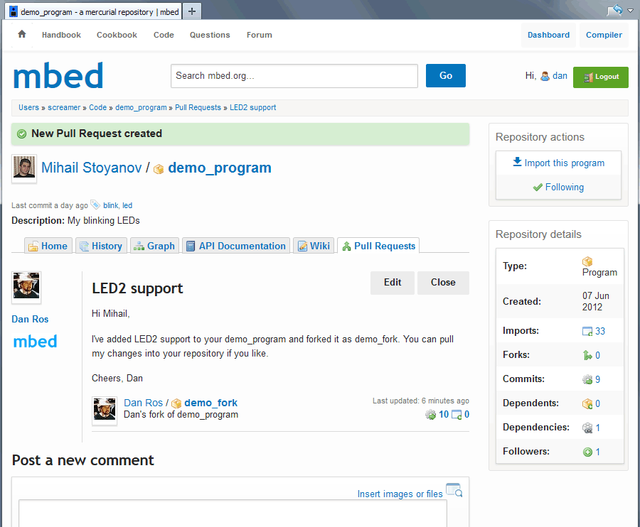

### Editing an existing pull request

Pull requests are `limited` to the latest revision at the moment of sending. This means that you can publish more changes to your repository, and the other party will only see the changes that were available when the pull request was created. 

To update your pull request to the latest revision:

1. Click the **Edit** button on the pull request page.
1. Check the **Update request to latest revision(s)?** checkbox.
1. Submit the edit. The other party is notified that you edited the pull request. 

## Managing a pull request you receive 

### Viewing pull requests 

When a pull request is sent to a repository to which you're author or co-author, you receive an email notification with the pull request details and a link to the pull request page. 

You can also see all existing pull requests by visiting the repository page and clicking on the **Pull Requests** tab:

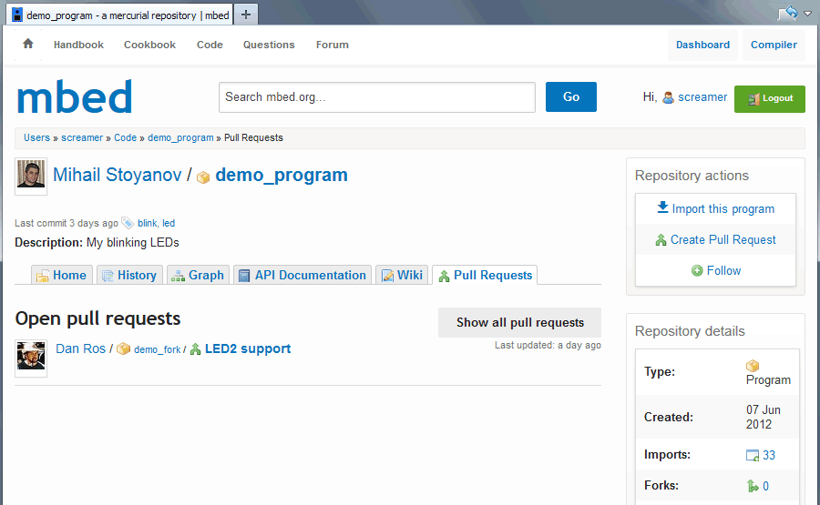

**Tip:** This will only list the open pull requests. To view all pull requests, including the closed ones (accepted or rejected) click the **Show all pull requests** button.

On each pull request page you can discuss changes, coding standards and so on before accepting or rejecting the request. Once closed, you won't be able to add more comments.

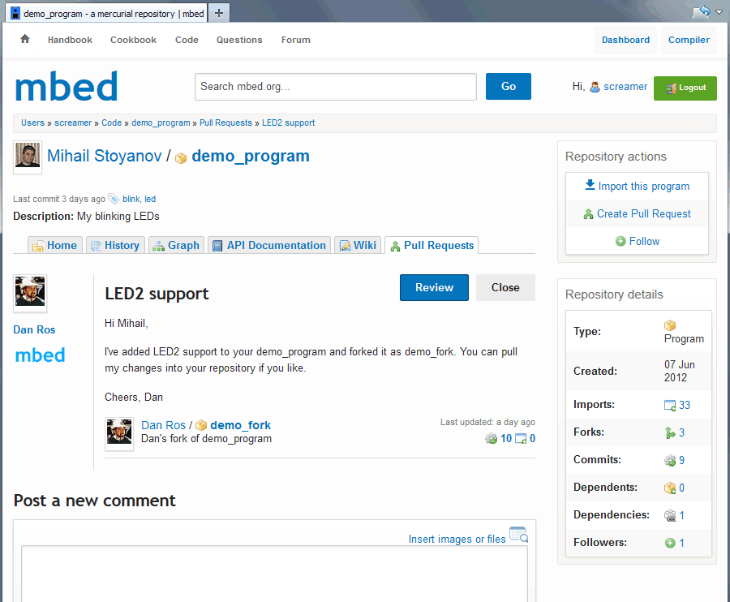

To quickly close a pull request without reviewing it, click the **Close** button.

### Reviewing a pull request

Most online services that offer source code and version control hosting let you review and merge pull requests.

We went a step further by letting you review, compile, test and add more changes before accepting a pull request, by harnessing the power of the mbed Online Compiler.

You'll need to import a pull request to your mbed Online Compiler workspace as a separate program or library, so it won't interfere with the codebase of your original program. You can then freely and safely experiment with the changes.

To review a pull request:

1. Click the **Review** button on the pull request page (as shown above). The mbed Online Compiler opens in a new browser tab; if you already have the mbed Compiler open, switch to that tab.

1.  The mbed Compiler suggests an import name based on your repository name and a `_pullrequest` suffix, to remind you that this was imported as part of a pull request. You're free to change the name:

	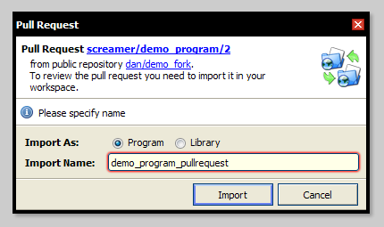

1. Click "Import".

1. The pull request is imported to your workspace, and the Revisions panel opens:
	
	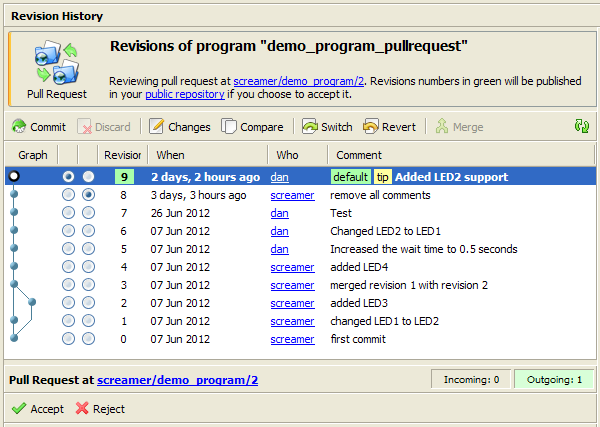

Newly introduced revisions are marked in green. These are the proposed changes - the ones you are being asked to pull. To review individual changes, click on the files list on the right. 

The mbed Online Compiler remembers the pull request status of an imported program or library across sessions, so you can always close the Revision History panel and continue the review later. For example, you can open one of the changed files in the Editor, click **Compile** to check whether their code compiles successfully. If it does, you can download and test it on your mbed Enabled device.

### Accepting a pull request

Click the **Accept** button in the bottom panel, and an accept confirmation dialog opens:

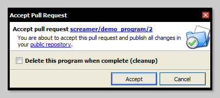

You can clean up the imported program by checking the **Delete this program when complete (cleanup)** button.

Accepting a pull request publishes to your repository both the contents of that pull request, and any changes you made to the pull request. It also marks the pull request as accepted:

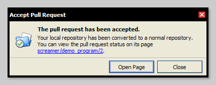

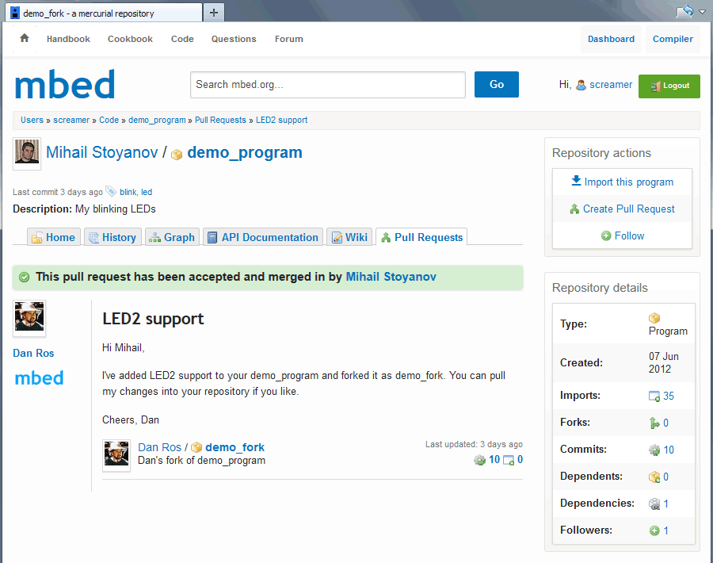

### Rejecting a pull request

If you choose to reject the pull request:

1. Click the **Reject** button in the bottom panel. A confirmation dialog opens:

	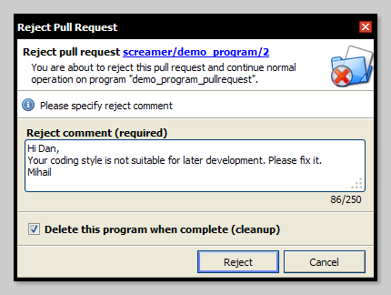

1. Enter a comment explaining the rejection. 

1. You can clean up the imported program by checking the **Delete this program when complete (cleanup)** button.

1. Click **Reject**.

1. The comment is posted on the pull request page on your behalf, and the pull request is marked as rejected.

**Note:** If you're not satisfied with the code, you can always attempt to enhance it by introducing your own changes on top of the pull request. You can then accept the pull request; the published pull request will include the changes you have made to the original content.

