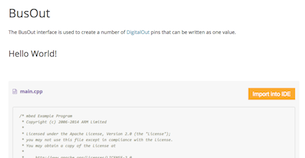
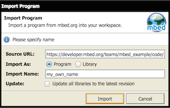
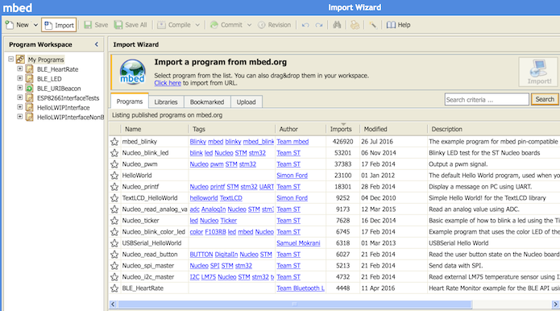
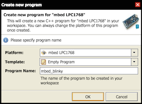
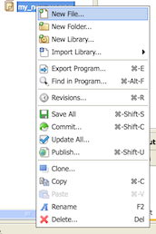
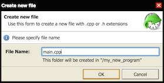
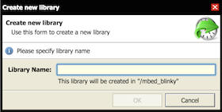

# mbed Online Compiler

The online compiler enables you to either write your code from scratch or import an existing project and modify it to suit your needs. The only thing you need is [an mbed developer account](https://developer.mbed.org/account/signup/).

The compiler is always available on [https://developer.mbed.org/compiler/](https://developer.mbed.org/compiler/).

## Importing code to the compiler

There are two methods of importing the code into the online compiler: directly from a program presented on the site, or using the compiler’s Import button:

1. Directly from the site: wherever you see a program on the site, you should see an Import button:
	
	

	Clicking that button will take you to the compiler; you can then give the program a new name and import it to your workspace:

	

1. The compiler's Import button: click the **Import** button in the compiler to open the Import Wizard:

	

	You can search for a program by name, or perform an empty search to show all available programs:

	

	Double click a program to import it.

## Creating a new program 

1. From the **New** menu, select **Program**:

	

1. The **Create new program** pop-up opens.
	1. Select your platform (board). 
	1. You can create from an existing template, or from an empty program.
	1. Enter a unique name.

	

1. Create a ``main.cpp`` file in your program:
	1. Right click on the program and select **New File...**. The **Create new file** popup opens.

		

	1. Enter ``main.cpp`` as the file name.

		

1. Import the mbed OS library so you can build your program with the mbed OS code base:
	1. Click **Import**. The Import Wizard opens.
	1. Go to the Libraries tab and search for "mbed", or perform an empty search to show all libraries:

	

	1. Double click on "mbed" to import it. The library is added to your program.

	

## Creating a new library

1. From the **New** menu, select **Library**:

	

1. The **Create new library** pop-up opens. Enter a unique library name.

	

## Compiling and downloading

### Selecting your board

mbed programs can be built to run on multiple boards. The hard work is done behind the scenes, by mbed OS itself. All you need to do is tell the mbed Online Compiler which board you're building for.

#### Adding a board to your list

To add a board to your list, go to the board's page on mbed.com and click the **Add to your mbed Compiler** button:

#### Selecting a board

The compiler shows the current build board's name on the upper right corner:

Click the name to change your board as needed:

## Video summary

## Keyboard shortcuts

### Navigation

| Shortcut   | Description                                       |
|------------|---------------------------------------------------|
| Hold Ctrl  | Interactive mode                                  |
| Shift + Home | Select from current position to beginning of line |
| Shift + End  | Select from current position to end of line       |
| Ctrl + Home  | Go to beginning of file                           |
| Ctrl + End   | Go to end of file                                 |
| Ctrl + Shift + Home | Select from current position to beginning of file |
| Ctrl + Shift + End | Select from current position to end of file  |
| Shift + Page Up  | Select from current position up one page |
| Shift + Page Down | Select from current position down one page |
| Shift + any arrow  | Extend or reduce text selection |
| Ctrl + left arrow  | Go to beginning of the previous word |
| Ctrl + right arrow   | Go to beginning of the next word |
| Ctrl + up arrow | Scroll up one row |
| Ctrl + down arrow | Scroll down one row |                            

### Ctrl key sequences

| Shortcut   | Description                                       |
|------------|---------------------------------------------------|
| Ctrl + A  | Select all                                  |
| Ctrl + B | Compile only (no download prompt) |
| Ctrl + Shift + B | Compile all and download |
| Ctrl + C | Copy (only selected text) |
| Ctrl + Shift + C | Commit |
| Ctrl + D | Compile and download |
| Ctrl + Shift + D | Duplicate line |
| Ctrl + E | Erase current line |
| Ctrl + F | Find and replace |
| Ctrl + Alt + F | Find in files |
| Ctrl + Shift + F | Format code (selected text or current file) | 
| Ctrl + H | Find and replace |
| Ctrl + K | Find and replace | 
| Ctrl + L | Change selected text to lower case |
| Ctrl + R | Current file's revision history (must be in single file mode) |
| Ctrl + S | Save current file |
| Ctrl + Alt + S | Save as |
| Ctrl + Shift + S | Save all |
| Ctrl + U| Change select text to upper case |
| Ctrl + V | Paste text from clipboard |
| Ctrl + W | Close current file (doesn't work on Chrome |
| Ctrl + Shift + W | Close all (doesn't work on Chrome |
| Ctrl + X | Cut selected text |
| Ctrl + Y | Redo |
| Ctrl + Z | Undo |
| Ctrl + / | Toggle line comment (using slashes) |
| Ctrl + Shift + / | Toggle block comment (using /* ... */)| 

### Misc

| Shortcut   | Description                                       |
|------------|---------------------------------------------------|
| Tab  | Increase text indent                                  |
| Shift + Tab | Decrease text indent |
| Esc | Close find or toggle editor area full screen |
| Ins | Toggle insert mode |
| Ctrl + Ins | Copy selected text |
| Shift + Ins | Paste text from clipboard |
| Shift + Del | Cut selected text |
| F8| Compile only (no download prompt |
| F9 | Compile and download |
| F10 | Compile all and download |

### Touch device shortcuts

#### Editor

| Shortcut   | Description                                       |
|------------|---------------------------------------------------|
| Single tap  | Move the cursor                                |
| Double tap | Text selection on the tapped word (opens context menu) |
| Triple tap | Text selection on the tapped row (opens context menu) |
| Hold | Context menu |
| Touch + drag | Text selection until the touch is released (opens context menu) |

#### Compiler IDE

| Shortcut   | Description                                       |
|------------|---------------------------------------------------|
| Single tap  | Equivalent to single mouse click  |
| Double tap |  Equivalent to double mouse click  |
| Hold |  Equivalent to right click (opens context menu) |
| Touch + drag | Equivalent to mouse dragging |
