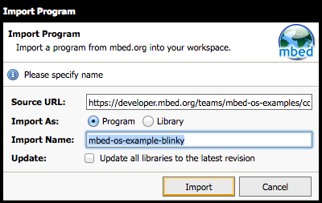
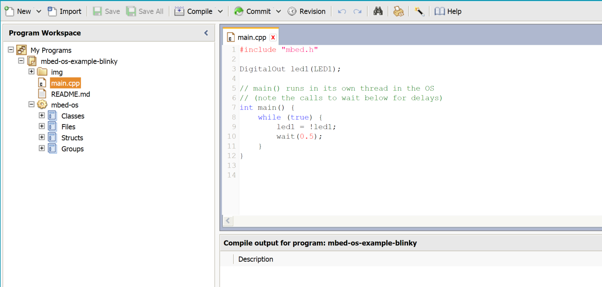
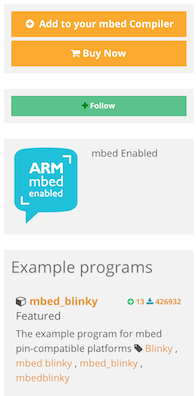
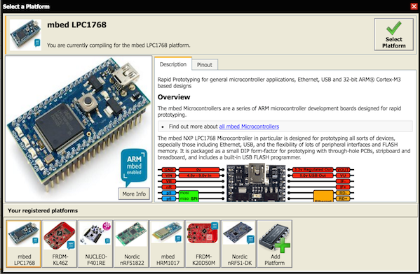

# Blinky on the mbed Online Compiler

Please get a [developer account](https://developer.mbed.org/account/signup/). It's free, and we don't spam.
 
## Importing Blinky

To get Blinky into the mbed Online Compiler, click the **Import to IDE** button below:

The import mechanism offers a default name, but you're free to change it. When you're done, click **Import**.

## Viewing Blinky

The imported Blinky has two interesting parts:

* ``main.cpp``, where the Blinky-specific code is. You can double-click the file in the left-hand navigation to view the code.
* ``mbed-os``, where the mbed OS codebase is.

Later we'll compile the code; this will take both of these parts and create a single application file from them.

## Selecting a target board

The mbed Online Compiler can build your application to match any mbed Enabled board. However, you have to select the target before compiling.

### Adding a board to your list

To add a board to your list, go to the board's page on mbed.com and click the **Add to your mbed Compiler** button:

### Selecting a board

The compiler shows the current build board's name on the upper right corner:

Click the name to change your board as needed:

