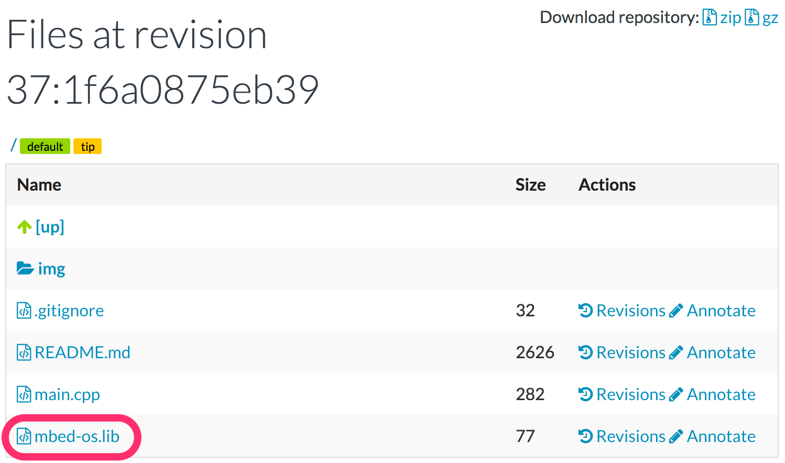
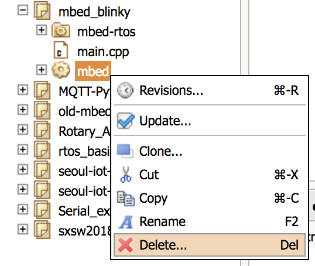
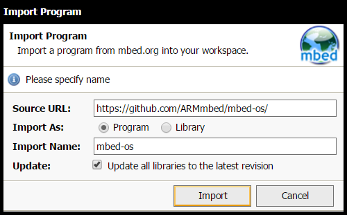

<h1 id="migrating">Mbed OS 2 to 5 migration guide</h1>

This guide is to assist you in the process of updating an existing [component](https://os.mbed.com/components/), library or program from Mbed OS 2 to Mbed OS 5.

## Prerequisites

- [Mbed CLI](../tools/developing-mbed-cli.html).
- An [offline compiler](../tools/index.html#compiler-versions).

## Identifying old versions of Mbed OS

This guide uses the Grove temperature and humidity sensor as an example: [Grove-TempHumi-Sensor](https://os.mbed.com/components/Grove-TempHumi-Sensor/).

First, navigate to the Hello World repository for the component.

<span class="images"><span>Hello World repository for the component</span></span>


Next, view the files in the Hello World repository. The presence of an `mbed.bld` or `mbed-rtos.lib` file signifies that this program uses an older version of Mbed OS (older than Mbed OS 5).

<span class="images"><span>Older version of Mbed OS `mbed.bld` or `mbed-rtos.lib` files in the Hello World repository</span></span>


A program that uses and has been tested with Mbed OS 5 or later has an `mbed-os.lib` file.

<span class="images"><span>Mbed OS 5 or later `mbed-os.lib` file in the Hello World respository</span></span>

Some repositories may have both an `mbed.bld` file and an `mbed-rtos.lib` file present. Mbed-RTOS is the precursor to Mbed OS 5, which combines the older Mbed OS 2 library with Mbed-RTOS. So, Mbed OS 5 can replace both `mbed.bld` and `mbed-rtos.lib`.

## Migrating to Mbed OS 5

Migrating to Mbed OS 5 results in two possible outcomes:

1. Replacing the old Mbed library with Mbed OS is successful because the APIs in the library have not changed. In this instance, you're finished.
2. Replacing the old Mbed library with Mbed OS produces some compilation errors. These errors can occur in the library or in the application code for the following two reasons:
  - The Mbed OS API calls are out of date, and you need to migrate to the updated Mbed OS API syntax.
  - There is target specific code, and you need to migrate it to use the code for the specific target you are compiling for.

To update to Mbed OS 5 with the [Mbed CLI](../tools/developing-mbed-cli.html), run:

```
mbed import [URL of Project]
cd [Project Name]
mbed remove mbed
mbed add mbed-os
```

To determine the success of migration, run:

`mbed compile -m [platform] -t [toolchain]`

To update to Mbed OS 5 with the [Mbed Online Compiler](../tools/developing-mbed-online-compiler.html):

1. Open your project in the Online Compiler.
1. Right click on **mbed** and select **Delete...**:

    <span class="images"><span>Delete mbed</span></span>

1. If your project includes `mbed-rtos`, you also need to delete this library to successfully update to Mbed OS 5. Right click on **mbed-rtos**, and select **Delete...**:

    <span class="images"><span>Delete mbed-rtos</span></span>

1. Right click on the name of your project, hover over **Import Library** and then select **From URL**:

    <span class="images"><span>Import library from URL</span></span>

1. Copy and paste the URL for Mbed OS 5 `https://github.com/armmbed/mbed-os`, and then click **Import**:

    <span class="images"><span>Mbed OS 5 URL</span></span>

To determine the success of migration, select your board in the top right corner of the Online Compiler, and click  **Compile**.

### Example component 1 - successful initial migration

Repositories used in this example:

- Component: [Grove - Buzzer](https://os.mbed.com/components/Grove-Buzzer/).
- Hello World repo: [Seeed_Grove_Buzzer](https://os.mbed.com/teams/Seeed/code/Seeed_Grove_Buzzer/).

Compile configuration used in this example:

- Platform: [u-blox EVK-ODIN-W2](https://os.mbed.com/platforms/ublox-EVK-ODIN-W2/).
- Toolchain: [GCC ARM](https://developer.arm.com/open-source/gnu-toolchain/gnu-rm/downloads).

In the command-line, run:

```
mbed import https://os.mbed.com/teams/Seeed/code/Seeed_Grove_Buzzer/
cd Seeed_Grove_Buzzer
mbed remove mbed
mbed add mbed-os
mbed compile -m ublox_evk_odin_w2 -t gcc_arm
```

It successfully compiles, so that no changes to the `Grove - Buzzer` library or `Hello World` program are necessary.

### Example component 2 - application fails to compile

Repositories used in this example:

- Component: [SRF08-Ultrasonic-Range-Finder](https://os.mbed.com/components/SRF08-Ultrasonic-Range-Finder/).
- Hello World repo: [SRF08HelloWorld](https://os.mbed.com/users/melse/code/SRF08HelloWorld/).

Compile configuration used in this example:

- Platform: [FRDM-K64F](https://os.mbed.com/platforms/FRDM-K64F/).
- Toolchain: [GCC ARM](https://developer.arm.com/open-source/gnu-toolchain/gnu-rm/downloads).

In the command-line, run:

```
mbed import https://os.mbed.com/users/melse/code/SRF08HelloWorld/
cd SRF08HelloWorld
mbed remove mbed
mbed add mbed-os
mbed compile -m k64f -t gcc_arm
```

#### Compilation errors

After you have cloned the repository to your computer and deployed the latest version of Mbed OS, check whether any compilation errors exist.

Here is the output produced from `mbed compile`:

```
Building project SRF08HelloWorld (K64F, GCC_ARM)
Scan: .
Scan: env
Scan: mbed
Scan: FEATURE_LWIP
Scan: FEATURE_STORAGE
Compile [  0.3%]: AnalogIn.cpp
Compile [  0.6%]: BusIn.cpp
Compile [  0.8%]: main.cpp
[Error] main.cpp@4,13: 'p9' was not declared in this scope
[Error] main.cpp@4,17: 'p10' was not declared in this scope
[ERROR] .\main.cpp:4:13: error: 'p9' was not declared in this scope
 SRF08 srf08(p9, p10, 0xE0);      // Define SDA, SCL pin and I2C address
             ^~
.\main.cpp:4:17: error: 'p10' was not declared in this scope
 SRF08 srf08(p9, p10, 0xE0);      // Define SDA, SCL pin and I2C address
                 ^~~

[mbed] ERROR: "c:\python27\python.exe" returned error code 1.
[mbed] ERROR: Command "c:\python27\python.exe -u C:\Repos\SRF08HelloWorld\mbed-os\tools\make.py -t gcc_arm -m k64f --source . --build .\BUILD\k64f\gcc_arm" in "C:\Repos\SRF08HelloWorld"
```

This is a target-specific error. The pins in the `Hello World` application do not exist on this target, K64F. To fix this, replace the SDA and SCL pins with the ones present on the K64F. Use the [K64F platform page](https://os.mbed.com/platforms/FRDM-K64F/) to find the correct pins. D14 and D15 work. So, `main.cpp` now looks like this:

```
#include "mbed.h"
#include "SRF08.h"

SRF08 srf08(D14, D15, 0xE0);      // Define SDA, SCL pin and I2C address

int main() {

    while (1) {
       printf("Measured range : %.2f cm\n",srf08.read());
       wait(0.1);
    }

}
```

Now, the program successfully compiles.

## Runtime errors

Although the program or library now compiles successfully, runtime errors may still be present. Please visit the [compile-time errors tutorial](compile-time-errors.html#runtime-errors-and-lights-of-the-dead) for further debugging tips about common errors.

<h1 id="enabling-bare-metal">Enabling Mbed OS bare metal</h1>

Enabling the Mbed OS bare metal profile allows you to build Mbed OS without an RTOS. To enable it, you have to complete the [migration to Mbed OS 5](#migrating-to-mbed-os-5). Once the migration is complete, you can enable Mbed OS bare metal by following the instructions in the [bare metal example](../reference/bare-metal-example-application.html).
