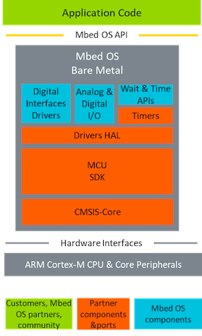

# Mbed OS bare metal profile

Bare metal is a profile of Mbed OS for ultraconstrained devices. Unlike the full Mbed OS, which by default includes all APIs, the bare metal profile starts with a minimal set of APIs to which you can add only the APIs your application or hardware demand. This helps you control the size of your final binary.<!--not sure that's a good term-->

Bare metal doesn't use the RTOS APIs. Instead, it relies on timers to control the workflow.
<!--not sure I get it - I looked at both Blinky examples and they both use thread_sleep_for, even though the bare metal one doesn't include mbed_thread.h-->
<!--what other APIs does it have or not have by default?-->

The Mbed OS tools - Mbed CLI, Mbed Online Compiler and Mbed Studio all support working with the bare metal profile.

Note that Mbed TLS and Mbed Crypto are not supported for bare metal.

Mbed OS bare metal profile block digram

## Documentation

- To see how to enable the profile, or to try the bare metal Blinky, see [our example page]().
- To learn how to add APIs, [see the bare metal API page]().
- If you're an Mbed OS 2 user, migrate to the Mbed OS 6 bare metal profile by following [our migration guide]().<!--that's not application develoeprs though, right? it's for hardware people?-->
