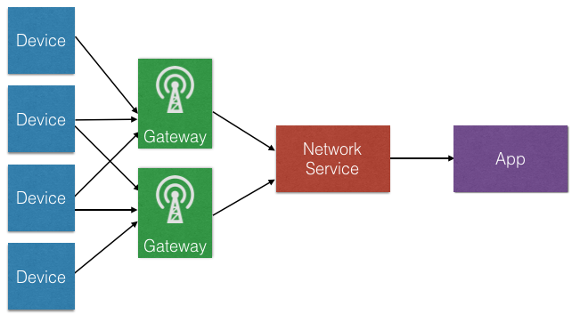

### Building your own private LoRa network

There is a lot of buzz about [LoRa](https://www.lora-alliance.org), a wide-area network solution that promises kilometers of range with very low power consumption, a perfect fit for the Internet of Things. Telecom operators are rolling out LoRa networks, but because LoRa operates in the [open spectrum](https://en.wikipedia.org/wiki/ISM_band), you can also set up your own network. This article discusses the requirements to build a private LoRa network and how to use the network to send data from an ARM mbed end-node to the cloud.

**Note on LoRa vs. LoRaWAN:** Technically, we're building a LoRaWAN network in this article. LoRa is the modulation technique used (PHY), and LoRaWAN is the network protocol on top of the physical layer (MAC).

#### Requirements

A typical LoRa network consists of four parts: devices, gateways, a network service and an application:

Topology of a LoRa network

For hardware, you need devices and gateways, similar to how you would set up a Wi-Fi network. Gateways are simple: they just scan the spectrum and capture LoRa packets. There is no gateway pinning here - devices are not associated with a single gateway; thus, all gateways within range of a device receive the signal. The gateways then forward their data to a network service that handles the packet.

The network service deduplicates packets when multiple gateways receive the same packet, decrypts the message (everything is end-to-end encrypted), handles LoRa features such as adaptive data rating and so on. It then forwards the decrypted data to your application.

There are five requirements.

We need hardware:

* Gateways.
* Devices.

And we need software:

* Device firmware.
* A network service.
* An app.

This guide shows you which hardware you can buy and two online services you can use to write device firmware and handle your LoRa traffic.

##### Getting a gateway

You have [a lot of choices in the gateways](https://www.loriot.io/gateways.html) you can use, but we've had good experience with these three:

* [Kerlink IoT station](http://www.kerlink.fr/en/products/lora-iot-station-2/wirnet-station-868). Expensive (around 1,200 euros) but great build quality and range.
* [MultiTech Conduit](http://www.multitech.com/brands/multiconnect-conduit). About one-third of the price of the Kerlink (about 450 euros) and good for small setups. (Put a bigger antenna on it though.) MultiTech also has a [rugged outdoor](http://www.multitech.com/brands/multiconnect-conduit-ip67) version.
* Building your own with a Raspberry Pi and an [IMST iC880A](http://webshop.imst.de/catalogsearch/result/?q=iC880A) concentrator. At about 230 euros, this is the most cost-efficient option.

Self-built LoRa gateway based on Raspberry Pi 2 and IMST iC880A. Total cost is about 230 euros.

For development purposes, one gateway is enough, but in a production deployment, you need at least two because there will always be dark spots in your network.

##### Getting a device

You also need to build devices. If you use ARM mbed (and you should), you can either use:

* A development board with a LoRa transceiver:
    * [MultiTech xDot](https://developer.mbed.org/platforms/MTS-xDot-L151CC/).
        * The xDot is already FCC/CE certified and shielded, so it's a good choice if you want to build custom hardware.
    * [MultiTech mDot](https://developer.mbed.org/platforms/MTS-mDot-F411/) and the [UDK2 board](http://www.digikey.com/product-detail/en/multi-tech-systems-inc/MTUDK2-ST-MDOT/591-1278-ND/5247463).
        * As an alternative, you can use the [MultiTech mDot EVB](https://developer.mbed.org/platforms/mdotevb/), which is the mDot reference design.
        * Like the xDot, the mDot is already FCC/CE certified and shielded.
* A microcontroller that runs mbed (in this article, we're using the [Nordic nRF51-DK](https://developer.mbed.org/platforms/Nordic-nRF51-DK/), though most microcontrollers work) with a LoRa shield:
    * [SX1272MB2xAS](https://developer.mbed.org/components/SX1272MB2xAS/) - shield based on the SX1272 transceiver.
    * [SX1276MB1xAS](https://developer.mbed.org/components/SX1276MB1xAS/) - shield based on the SX1276 transceiver.

This document contains instructions for the MultiTech mDot and the SX1276MB1xAS shield, but the same principles apply to all other combinations.

**Note:** When ordering hardware, always make sure you get the variant that works in your region (for example 868 MHz in Europe, 915 MHz in the US).

##### Network server

Now on to the software side. You need a server that understands the LoRa protocol and can interpret the data the device sends. It's possible to roll your own (Semtech can give you its reference implementation if you sign an NDA), but there are also companies building LoRa network servers as a service, handling everything on your behalf. This article discusses two such services: the Switzerland-based startup [LORIOT](https://loriot.io), and [IoT-X](http://iot-x.com) from the UK-based Stream Technologies.

Because a network server only processes your data and doesn't store it, you need a place to store your messages, as well. Both services allow you to hook into their service over a TCP socket, websocket or MQTT client and forward your data to the cloud service of your choice (or straight to your application).

###### LORIOT

LORIOT is free for up to one gateway and up to ten end-devices. The free plan has some limitations: it does not include bidirectional data (sending messages back from the cloud to a device) or over-the-air activation. You can buy these services as an upgrade though (starting at 57 euros per month).

###### IoT-X

IoT-X is a connectivity management platform from Stream Technologies, which handles both cellular and LoRa connected devices. A [form to request a trial](http://iot-x.com/iotx/) is available on its website.

#### Setting up the gateway

You now need to configure the gateway by installing software that scans the spectrum and forwards all LoRa packets to the network server. To do this, you will need to log into the gateway. Below are setup instructions for the three gateways suggested earlier.

**Note:** This section assumes that you're familiar with SSH.

##### Kerlink IoT station

To configure the Kerlink:

1. Connect the gateway to your network over Ethernet.
1. The gateway gets an IP through DHCP.
1. To quickly find the gateway, look in the DHCP table on your router or use [nmap](http://nmap.org) via `nmap -p 22 192.168.2.*` (if that's your subnet).
1. You can now log into the gateway through SSH with the username `root` and password `root`.

##### MultiTech Conduit

The Conduit is configured with DHCP disabled, so you need to enable this first. There are two options to do this: either via Ethernet or via micro-USB.

__Using Ethernet__

1. Connect to the Conduit over Ethernet (from the Conduit to your computer).
1. Set a static IP address of 192.168.2.2 for your computer.
1. Set a static IP address of 192.168.2.1 as your router.
1. Log in through SSH to 192.168.2.1 with the username `root` and password `root`.

__Over micro-USB__

1. Connect to the Conduit using a micro-USB cable.
1. The gateway appears as a serial device.
1. You can use a program such as [GNU screen](https://www.gnu.org/software/screen/) or [PuTTY](http://putty.org) to log into the gateway with the username `root` and password `root`.

**Note when logging in fails:** If logging in as `root` fails, but you can log in with the username `admin` and the password `admin`, you are running the AEP firmware. To proceed, update your gateway firmware to mLinux. Instructions are [here](http://www.multitech.net/developer/software/mlinux/using-mlinux/flashing-mlinux-firmware-for-conduit/).

Now that you are connected, you can set up the gateway:

1.  Enable DHCP by following Step 4 in [this document](http://www.multitech.net/developer/software/mlinux/getting-started-with-conduit-mlinux/).
1. Connect the gateway over Ethernet to your router.
1. Follow the steps under [Kerlink IoT station above](#kerlink-iot-station) to find the IP address and log in over SSH.

##### Raspberry Pi and IMST iC880A

First, make sure that the Raspberry Pi is connected to the internet and that you connected the IMST iC880A over USB. (If you have the SPI version, look at the [IMST website](http://www.wireless-solutions.de/products/radiomodules/ic880a)).

Log into the Pi over SSH, and follow Steps 3.1 - 3.5 in [this document](http://www.wireless-solutions.de/images/stories/downloads/Radio%20Modules/iC880A/iC880A_QuickStartGuide.pdf).

**Note:** Use [lora_gateway 2.0.0](https://github.com/Lora-net/lora_gateway/releases/tag/v2.0.0), not the latest version. (Run `git checkout v2.0.0` in the lora_gateway folder).

After following these steps:

1. Restart the Pi.
1. Run:

    ``~/LoRa/lora_gateway/lora_gateway/util_pkt_logger/util_pkt_logger``

1. You see 'INFO: concentrator started, packet can now be received', which indicates that everything is functioning.

#### Setting up the network server

Now that you have set up the gateways and they can reach the internet, it's time to install the network service software on them, so they have a place to send the LoRa packets.

* [Continue setting up your network with LORIOT](loriot.md).
* [Continue setting up your network with IoT-X](iotx.md).
