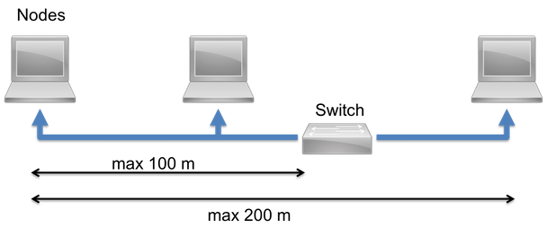

<h2 id="ethernet-technology">Ethernet</h2>

Term Ethernet refers to technologies first introduced in 1980 and standized in 1983 as IEEE 802.3.
Ethernet is a wired network, usually implemented by twisted pair wiring, but optical fibre and coaxials exists as well. However, coaxial has been superceded and not used anymore.
Initial the speed from the standard was 1Mb/s but later standards increased it to first 10 Mb/s and later 100 Mb/s and 1 Gb/s, where later two remain the most popular connection speeds today.
Ethernet can use cable length for up to 100 meters, and when connected to switch, allow maximum segment length to span 200 meters.

Ethernet segment

### Ethernet connection speeds

After introducing the initial standard IEEE has improved the Ethernet by making it faster and cheaper and have released subsequent standards covering these improvements.

| Speed     | Name       | Standard     | Year | Description |
|-----------|------------|--------------|------|-------------|
| 10 Mb/s   | 10BASE-5   | IEEE 802.3   | 1983 | First Ethernet standard, used thick coaxial cable. |
| 10 Mb/s   | 10BASE-2   | IEEE 802.3a  | 1985 | Superseded the first coaxial by using thinner and cheaper cable. Now both obsoleted by newer versions of IEEE 802.3 |
| 10 Mb/s   | 10BASE-T   | IEEE 802.3i  | 1990 | Became most popular Ethernet by replacing problematic coaxial cables. Uses CAT-3 twisted pair cable. |
| 100 Mb/s  | 100BASE-TX | IEEE 802.3u  | 1995 | Standard called "Fast Ethernet", uses CAT-5 twisted pair cable |
| 1000 Mb/s | 1000BASE-T | IEEE 802.3ab | 1999 | Increased the speed to 1 Gb/s by using CAT-5e cable. Together with 100BASE-TX remain the most popular standards today |

Today, most Ethernet devices are cabable of automatically negotiating connection speed 10/100/1000 with the switch they are connected. However, embedded devices rarely support 1 Gb/s connection speed.

### Ethernet frames

Ethernet framing has remained nearly untouched after its initial introduction, making it possible to connect devices with various speeds to same Ethernet segment. In Mbed OS Ethernet is used only for carrying IP frames.

Ethernet frame

**Fields in frame:**

DST
:   48 bit destination MAC address

SRC
:   48 bit source MAC address

Type
:   Originally this was length field, but later used as specifying the content type of payload. Also known as EtherType.
    Values higher than 1536 are registered type specifiers. Most commons are 0x0800 for IPv4 and 0x86DD for IPv6.

Q-Tag
:   Optional virtual lan ID.

FCS
:   Frame Check Sequence is used for integrity check. Implemented as CRC-32

### Follow up information

For understanding the use of Ethernet and TCP/IP in Mbed OS, study following sections of this book

* [IP networking](ip-networking.html)
* [Ethernet API](ethernet.html)
* [Socket API](socket-api.html)
