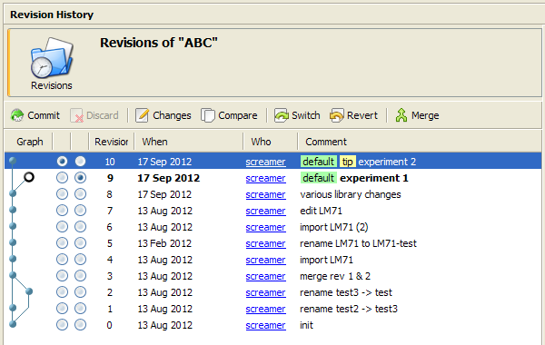
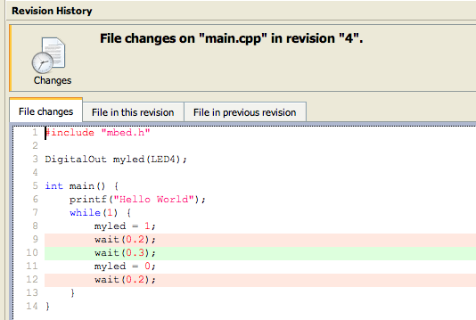

# Version control

You can use the Arm Mbed Online Compiler's version control features to let you version, branch and merge code. It will show a nice representation of the state of your project history:

The Online Compiler shows the current version of your project and your project's history

The approach should be familiar to those of you with experience of distributed version control models (as used by Mercurial and Git). Each program and library has its own local repository, so you can commit and perform actions on it within your own workspace (such as switching, branching and showing changes).

The main things you can do with a local repository are:

 * **Commit** a version of your project, and view the revision history.
 * **View** changes a version contains, and **compare** changes between versions.
 * **Switch** and **revert** to a different version.
 * **Branch** and **merge** versions.

**Tip:** You can also collaborate with others using version control: fork, push, pull, send pull request. These are covered in the [Collaboration page](collab-online-comp.html).

# Video tutorial

Here is the video that shows how you get started:

Watch how to use the Online Compiler's version control features

# Working with version control

Your program is the *working copy*. You can *commit* changes to its local repository to create new *revisions*.

You can choose to *switch* to a particular revision, which updates your working copy to that revision (for example, revert to a past state of your program). This is the way you can *branch*: do some commits, switch to a previous revision, do some more commits; you now have two branches of development derived from a common revision.

You can then *merge* a revision, often the head of one branch, into your working copy. This creates a working copy that is the combination of these two branches.

There is also the option to *discard* your working copy, and *revert* your working copy to a particular revision; unlike *switch*, this creates a working copy with the changes you need to get back to that previous state - more an "undo" than a branch.

You can see the changes between your current working copy and the previous revision, and changes between revisions:

The File changes section shows differences between this revision and the previous one

# Subrepositories and synchronization

Programs and libraries can depend on other published code to deliver a functionality. These dependencies are stored in reference files (such as `name.lib`) that are present in the codebase of the repository; when you import the codebase, the Mbed Online Compiler follows these references and imports other subrepositories, including referenced sub-subrepositories.

This synchronization mechanism ensures that the imported repository and all its subrepositories will be restored to the exact state they were when the author committed the changes to the parent repository (usually a program) and published it. This also makes it easy for everyone to use the code without worrying about dependencies, imports, revisions numbers and so on.

To ensure that a repository can be imported successfully, you must:

 - Publish all subrepositories (even sub-subrepositories) on [`os.mbed.com`](https://os.mbed.com).
 - Leave no uncommitted or unpublished changes in any subrepository.
