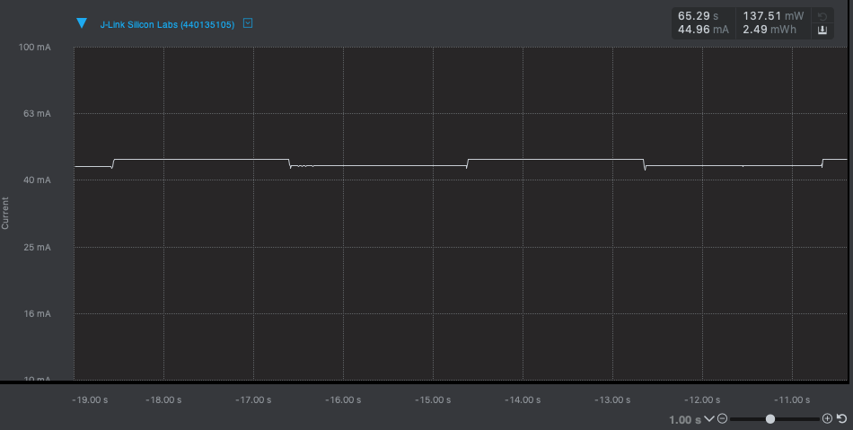
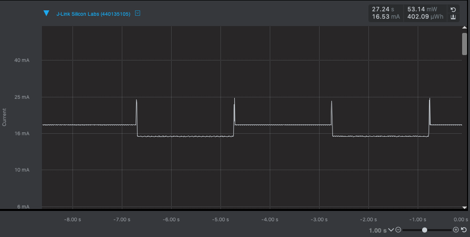
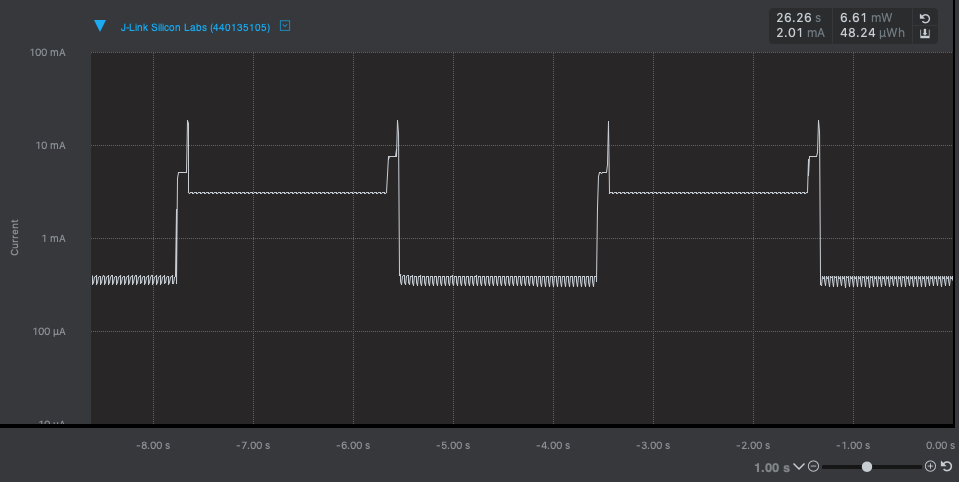
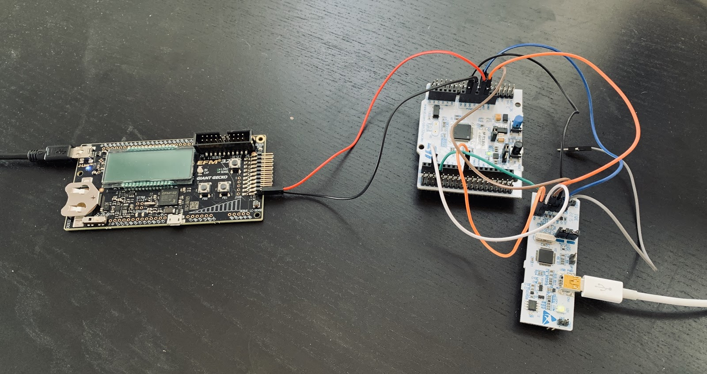
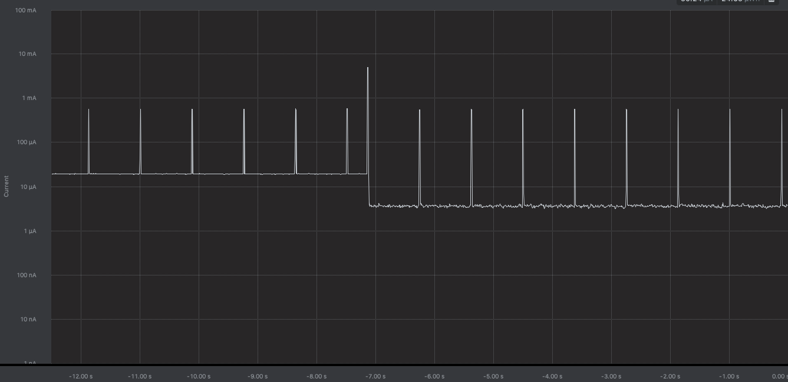

# Power optimization

IoT devices often claim they can run ten years on one battery, but building low-powered nodes is challenging. Complex products use multiple threads, a variety of active timers and sometimes a second core handling network connectivity. Sensors and other peripherals also use power. To help you manage these complexities while using the least amount of power, Mbed OS contains a number of low-power features, including low power tickers, tickless mode and the sleep manager. This tutorial explains how to use these features.

## Power modes

Mbed OS contains three [power modes](../apis/power-management-sleep.html):

- Active - The MCU and all clocks are running.
- Sleep - The core system clock is disabled. This eliminates dynamic power that the processor, memory systems and buses use.
- Deep sleep - In addition to the core system clock, all high-frequency clocks are disabled, and the [SysTick](../apis/rtos.html) is disabled.

Switching between these power modes occurs automatically. When all threads in the system are idle, Mbed OS yields control to the [idle thread](../apis/idle-loop.html). The idle thread then invokes the sleep manager, which brings the system to sleep or deep sleep mode. The idle thread also sets a timer to wake up the system again, but you can also wake up the system through an external interrupt or the low power ticker.

For example, this application automatically brings the system to sleep mode between blinking the LED:

```cpp
#include "mbed.h"

DigitalOut led(LED1);

int main() {
    while (1) {
        // blink the LED
        led = !led;
        // sleep for two seconds
        wait_ms(2000);
    }
}
```

The same principles also apply when using multiple threads or while using the [EventQueue](../apis/eventqueue.html). When all threads are idle, the system goes to sleep.

This leads to significant energy savings without any modification from you. For example, these images show the program mentioned above running first without sleeping, then with sleep mode enabled and finally with deep sleep mode enabled:

<span class="images"><span>Without sleeping, the MCU always consumes at least 43 mA.</span></span>

<span class="images"><span>By enabling sleep, the idle current goes down to 15 mA with clear peaks whenever you run some code.</span></span>

<span class="images"><span>In deep sleep mode, the idle current goes down to 358 uA. The jitter is noise from the energy profiler.</span></span>

<span class="notes">**Note:** The current consumption differs wildly between devices, even when comparing between MCUs from the same vendor. Look at the data sheet for your MCU to get an indication of power consumption in sleep and deep sleep mode.</span>

### Sleep and deep sleep

Whether the sleep manager puts the MCU in deep sleep instead of sleep depends on:

- Whether the device has low-power tickers available. These are required to wake up the MCU when high-frequency tickers are disabled. If low power tickers are available, the `DEVICE_LPTICKER` macro is set.
- Whether [tickless mode](../porting/tickless.html) is enabled. In tickless mode, the system can function without SysTick running. This is either enabled by the device, or by setting the `MBED_TICKLESS=1` macro.
- If any bus or driver is active that relies on the high-frequency clock, such as the SPI bus when doing asynchronous operations or a high-frequency [Timer](../apis/timer.html).
- The time until waking up, as waking up from deep sleep can take up to 10 ms.

To help you understand how much time the MCU spends in active, sleep and deep sleep modes and to determine what might be blocking deep sleep, you can enable CPU statistics and the sleep tracer.

### CPU statistics

To enable CPU statistics, which show you how much time is spent in various modes, add the following line to the `target_overrides` section of your `mbed_app.json` file:

```
           "platform.cpu-stats-enabled": 1
```

You can now call the `mbed_stats_cpu_get()` function to retrieve information on sleep behavior. For example:

```cpp
#include "mbed.h"
#include "mbed_stats.h"

static DigitalOut led(LED1);

int main() {
   while (1) {
       led = !led;
       wait_ms(2000);

       mbed_stats_cpu_t stats;
       mbed_stats_cpu_get(&stats);
       printf("Uptime: %llu ", stats.uptime / 1000);
       printf("Sleep time: %llu ", stats.sleep_time / 1000);
       printf("Deep Sleep: %llu\n", stats.deep_sleep_time / 1000);
   }
}
```

When your device supports low-power tickers and tickless mode, you see something like:

```
Uptime: 2099 Sleep time: 0 Deep Sleep: 2098
Uptime: 4202 Sleep time: 0 Deep Sleep: 4197
Uptime: 6305 Sleep time: 0 Deep Sleep: 6296
Uptime: 8407 Sleep time: 0 Deep Sleep: 8394
Uptime: 10510 Sleep time: 1 Deep Sleep: 10493
Uptime: 12613 Sleep time: 1 Deep Sleep: 12591
```

(The uptime does not go up by exactly 2000 ms because you also spend time writing the data out over serial).

### Blocking deep sleep

As stated before, some drivers and components can block deep sleep, either because they need access to the high-frequency timers (such as the `Timer` object), or because they cannot handle the latency that waking up from deep sleep introduces. This happens for example when attaching a receive interrupt on a UART. By the time the interrupt fires, the data that was written to the UART could no longer be there.

#### Acquiring a sleep lock

If your code requires blocking deep sleep, you can acquire a sleep lock. While the lock is active, Mbed OS will not bring the MCU into deep sleep mode. You can do this either by calling:

```cpp
sleep_manager_lock_deep_sleep();

// ... do your operation

sleep_manager_unlock_deep_sleep();
```

Or through the [DeepSleepLock](../mbed-os-api-doxy/_deep_sleep_lock_8h_source.html) RAII object. While the object is in scope, deep sleep is locked.

```
// some code here
{
    DeepSleepLock lock;
    // Code in this block runs with the deep sleep mode locked
}
// deep sleep mode is restored to the previous state
```

In addition, the `DeepSleepLock` object also has `lock` and `unlock` functions, which are useful for asynchronous operations.

#### Seeing active sleep locks

The sleep manager maintains a list of all active deep sleep locks and can log these whenever the device goes into sleep mode. This helps you determine what is blocking sleep. To enable these log messages, add the following macro to the `macros` section of your `mbed_app.json` file:

```
"MBED_SLEEP_TRACING_ENABLED"
```

For example, you can create a `Ticker` object that blinks the LED. The `Ticker` requires the high-frequency timers to be active:

```
#include "mbed.h"

static DigitalOut led(LED1);
static Ticker ticker;

void blink() {
   led = !led;
}

int main() {
   ticker.attach(&blink, 2.0f);
}
```

When you run this code with tickless enabled, this prints:

```
# at the beginning of the program
LOCK: Ticker.cpp, ln: 61, lock count: 1

# every time the device goes to sleep
Sleep locks held:
[id: Ticker.cpp, count: 1]
Sleep locks held:
[id: Ticker.cpp, count: 1]
```

Every time the device goes to sleep, this tells you a sleep lock is active. It also tells you where the lock was declared. To bring this device into deep sleep, you therefore need to get rid of the lock. You can either do this by using a low-power variant of the same class (`LowPowerTicker` in this case), or by only keeping the object that locks active when you actually need it. For example, a Wi-Fi module that uses a UART interrupt blocks deep sleep, so only keep the interrupt active when you expect a response from the module. For PWM, free the interface whenever you're not using it as to not block deep sleep.

**Tip:** Too much output from the sleep tracer? For a cleaner log, you can disable the code that logs all active locks when going to sleep in [mbed_sleep_manager.c](https://github.com/ARMmbed/mbed-os/blob/8e819de43e88a11428f3f7d21db7f6e7a534058a/platform/mbed_sleep_manager.c).

#### Mbed OS drivers that block deep sleep

This is a list of core Mbed OS drivers that block deep sleep:

- [Ticker](../apis/ticker.html) - if you don't need the precision of the high-frequency timer, you can use [LowPowerTicker](../apis/lowpowerticker.html) instead.
- [Timeout](../apis/timeout.html) - if you don't need the precision of the high-frequency timer, you can use [LowPowerTimeout](../apis/lowpowertimeout.html) instead.
- [Timer](../apis/timer.html) - if you don't need the precision of the high-frequency timer, you can use [LowPowerTimer](../apis/lowpowertimer.html) instead.
- [SPI](../apis/spi.html), when using the asynchronous APIs.
- [I2C](../apis/i2c.html), when using the asynchronous APIs.
- [CAN](../apis/can.html), if there is an interrupt attached.
- [PWM](../apis/pwm.html), after writing a value to a pin.
- Every class that inherits from `SerialBase`, such as [Serial](../apis/serial.html), if it has a receive interrupt attached. Additionally, deep sleep is blocked temporarily while using the asynchronous APIs for reading and writing.

Device-specific drivers (such as USB stacks) and networking drivers might also block deep sleep.

## Advanced topics

### Inner workings

When all threads are paused, the system [idle hook](../apis/idle-loop.html) is invoked. By default (though you can override this behavior), this yields control to the sleep manager. The sleep manager then either calls `hal_sleep()` or `hal_deepsleep()`, depending on whether deep is locked or permitted. The device implements these HAL functions, according to the following specifications:

- `hal_sleep()`:
   - Wake-up time should be less than 10 us.
   - The MCU should be able to wake up from any internal peripheral interrupt or from an external pin interrupt.
   - All peripherals need to operate the same way they do in active mode.
- `hal_deepsleep()`:
   - Wake-up time should be less than 10 ms.
   - The MCU should be able to wake up from the low-power ticker, an external interrupt and the watchdog timer.
   - High-speed clocks should be turned off.
   - RTC is running and keeps time.

Both HAL sleep functions work like an Arm Wait For Interrupt (WFI) instruction, where the function returns when there is a pending interrupt. To achieve this, the sleep manager calls these functions from a [critical section](../apis/criticalsectionlock.html). Often (though this is device specific) `hal_sleep` is implemented as just a `__WFI()` call, and deep sleep is the same call but surrounded by power control settings that limit the wake-up sources and functioning peripherals.

This is also why the MCU wakes up from sleep every millisecond when tickless is not enabled. In nontickless mode, SysTick needs to fire every millisecond and does this by setting an interrupt on the usticker. Right after the SysTick, the sleep manager puts the MCU back to sleep. However, this also means that in nontickless mode, you can't put the MCU in deep sleep because the wake-up latency is bigger than the SysTick interval.

For more information on the design of tickless and the sleep manager, please see the [office hours video with Bartek Szatkowski](https://www.youtube.com/watch?v=OFfOlBaegdg).

### Hibernate mode without RAM retention

All sleep modes in Mbed OS are implemented with RAM retention, but some MCUs have even lower power modes that completely stop the MCU and won't retain any information. After waking up, the MCU starts execution from the beginning of the program. Typically the only way to wake up from this mode is through an interrupt on a wake-up pin or from the low power ticker.

### Measuring power consumption

Accurately measuring the power consumption of deep sleep is challenging because of the huge dynamic range required, with current ranging from 1 uA to 100 mA. Also, the MCU is often awake for a very short amount of time, so measuring by hand is not practical. In addition, almost all Mbed Enabled development boards have a debug circuit that draws power (often much more than the MCU itself). Therefore, for accurate power measurement, you need:

- A current measurement probe. Some options that we have had good experiences with:
   - [QOITECH Otii](https://www.qoitech.com/) - acts as both a current and voltage measurement device and as a flexible power source for your device. This is probably your best option if you can spare $589.
   - [ULINKplus](http://www2.keil.com/mdk5/ulink/ulinkplus) - debugging probe that can be used together with Keil MDK that also provides current measurement. This is a good option if you already have an MDK license and is available for $690.
   - [SiLabs Giant Gecko](https://os.mbed.com/platforms/EFM32-Giant-Gecko/) - development board with a circuit that can also measure current [of an external MCU](https://www.silabs.com/community/mcu/32-bit/forum.topic.html/how_to_use_an_stkto-jLpQ). At $29, this is a much less expensive alternative to the dedicated probes, but it can only output 3.3V, which can be a problem when powering 5V peripherals.
   - [Nordic Power Profiler kit](https://www.nordicsemi.com/Software-and-Tools/Development-Kits/Power-Profiler-Kit) - originally made for Nordic development boards, you can also use this kit to measure current of any other MCU. It is available for $80 but can also only output a maximum of 3.3V.
- A way of powering the MCU (and preferably its peripherals) without powering the debug circuit. This is very specific to the development board.

1. Disable any peripherals that draw power but are not part of your application (such as a power LED). This might require you to physically remove components.

<span class="images"><span>Current measurement setup for this article</span></span>

This is the current measurement setup for the images earlier in this article. The STLink debug circuit is physically disconnected from the development board to avoid powering the debug circuit during measurement. The jumper wires from the STLink to the development board are there to reprogram the device. On the NUCLEO-F446RE board resistor R32 is removed to disable the power LED. The EFM32 Giant Gecko acts as the power source for the board, connecting VMCU on the Giant Gecko to 3.3 V on the NUCLEO-F446RE (and GND to GND). You can use Simplicity Studio to see the current measurement.

Unfortunately there is no generic way of doing this. There are probably hints in the help guide for your development board.

### Choosing and shutting down peripherals

It might seem like an open door, but putting the MCU to sleep is only part of a low power design: Peripherals can draw much more power than the MCU. The LED in the beginning of the article is drawing ~2.8 mA, much more than the rest of the circuit in deep sleep. Therefore, make sure to choose components that fit your power budget and shut peripherals down when you don't use them. Radios often have sleep modes you can invoke, so make sure your drivers use these.

Another option to consider is using a lower voltage design. Many MCUs can run at 1.8 V instead of 3.3 V, and choosing peripherals that can run on the same voltage drastically reduces your overall power consumption.

## Troubleshooting

### Stack overflow when enabling sleep tracing or CPU statistics

When enabling sleep tracing or CPU stats, the idle thread has to allocate more data. On some devices, this leads to stack overflows on the idle thread. If you encounter this, you can increase the stack size of the idle thread by adding the following section under `target_overrides` in `mbed_app.json`:

```
        "rtos.idle-thread-stack-size": 1024
```

### Device not entering deep sleep even though tickless is enabled

On some devices, the interrupt latency when running on the low-power tickers causes the device to drop bytes when running the serial at higher baud rates (such as 115,200). To mitigate this, these devices run tickless from the microsecond ticker instead of the low-power ticker, and this blocks deep sleep.

If your application does not require high baud rates, you can set the following macro to re-enable tickless from the low-power ticker:

```
MBED_CONF_TARGET_TICKLESS_FROM_US_TICKER=0
```

### Device wakes up from deep sleep every second (or other period)

Some devices wake from deep sleep for a small period every second, even when the device is instructed to wake up much later.

<span class="images"><span>Blinky with 10 second interval on DISCO-L475VG-IOT01A1</span></span>

This is related to the maximum timeout of the hardware low power ticker. It can only be asleep accurately for one second, so the device wakes up every second, and Mbed OS brings the device back into deep sleep afterward. You often can override this behavior by choosing a different clock source, but this is device specific. Look at the data sheet for your MCU. On the DISCO-L475VG-IOT01A1, you can override this by adding the following line to the `target_overrides` section of your `mbed_app.json`:

```json
        "target.lpticker_lptim_clock": 4
```

### Device does not sleep in bare-metal mode

The sleep manager does not load when running Mbed OS in bare-metal mode. We may add this capability in a future release. If you are developing in bare metal mode, call the `sleep()` function manually, and make sure you set up the wake up source.
